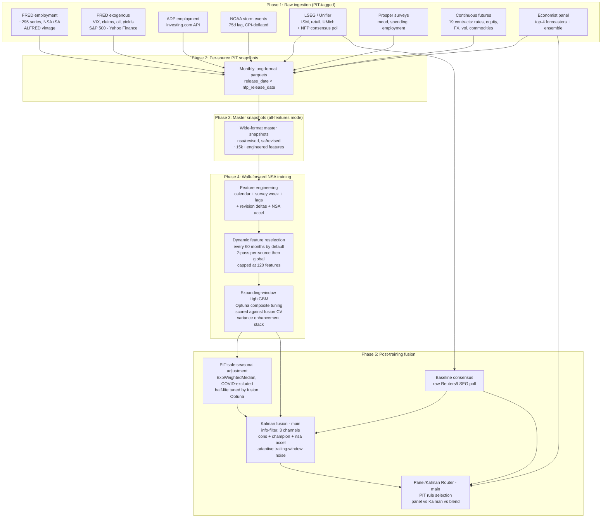

# NFP Predictor

An institutional-grade forecasting pipeline for the U.S. Non-Farm Payrolls (NFP) month-over-month (MoM) print. The final SA-revised outputs are a tuned **Kalman-filter fusion** and a **Panel/Kalman Router**. The Kalman model fuses the Reuters/LSEG consensus poll, an NSA LightGBM model run through a PIT-safe seasonal-adjustment overlay, and the NSA-implied acceleration signal; the router then tests whether the PIT economist panel, Kalman, or a conservative blend has been more reliable using only earlier realized months.

The system is built around three strict invariants:

1. **Point-in-time (PIT) correctness.** Every feature at target month $t$ must have been publicly known *strictly before* the BLS NFP release date for $t$. No same-day leakage, no peeked vintages, no `last_revision_date` shortcuts.
2. **Walk-forward only.** All metrics come from an expanding-window backtest — never K-fold CV, never random shuffles. The model is retrained from scratch each month using only data available before that month's NFP release.
3. **Native NaN handling.** LightGBM's split-finding algorithm consumes NaN directly. The pipeline never forward-fills or imputes feature values (the staggered start dates — FRED 1948, ADP 2001, Prosper 2009, Futures 2002, Economist Panel 2022 — encode genuine information that imputation would destroy).

> **Architectural note (2026-05):** A standalone SA LightGBM model is no longer trained. The canonical SA-revised forecast layer is now `consensus_anchor/`, whose two main models are `kalman_fusion/` and `panel_kalman_router/`. `--train-all` runs only the NSA branch, then always runs the consensus-anchor layer.

---

## Headline results (representative PIT backtests — 58 OOS months, SA-revised target)

| Forecast | MAE | RMSE | DirAcc | AccelAcc | STD Ratio | Diff STD Ratio | Role |
|---|---:|---:|---:|---:|---:|---:|---|
| **Panel/Kalman Router** | **85.5** | **126.3** | **98.3%** | 68.4% | 0.90 | 0.47 | **Main final model** |
| **Kalman Fusion (NSA)** | 95.5 | 133.6 | 96.6% | **71.9%** | 0.79 | 0.75 | **Main final model** |
| Baseline Consensus | 101.3 | 144.0 | 96.6% | 66.7% | 0.82 | 0.41 | Anchor / benchmark |
| Baseline Champion (NSA + Adj) | 182.7 | 234.5 | 84.5% | 68.4% | 1.30 | 2.04 | Diagnostic channel only |

The numbers shown come from the local no-tune post-train smoke replay in `_output_pairing_baseline_pitfix/`. A fresh tuned `--train-all` writes the authoritative values to `_output/consensus_anchor/comparison_metrics.csv` and declares the final two-model lineup in `_output/consensus_anchor/main_models.json`.

`AccelOverride` and `Kalman + AccelOverride post-filter` variants were removed on **2026-05-11** after consistently underperforming Consensus on the 60-month backtest window. Baseline Consensus, Panel Consensus Mean, and NSA+Adjustment remain diagnostics; the two main final forecasts are Kalman Fusion and Panel/Kalman Router.

---

## Table of Contents

1. [Why NFP forecasting is hard](#1-why-nfp-forecasting-is-hard)
2. [System architecture](#2-system-architecture)
3. [Quickstart](#3-quickstart)
4. [Repository structure](#4-repository-structure)
5. [Point-in-time data integrity](#5-point-in-time-data-integrity)
6. [Data sources — deep dive](#6-data-sources--deep-dive)
   - [6.1 FRED Employment](#61-fred-employment)
   - [6.2 FRED Exogenous](#62-fred-exogenous)
   - [6.3 ADP Employment](#63-adp-employment)
   - [6.4 NOAA Storm Events](#64-noaa-storm-events)
   - [6.5 LSEG Unifier](#65-lseg-unifier)
   - [6.6 Prosper Consumer Sentiment](#66-prosper-consumer-sentiment)
   - [6.7 Continuous Futures](#67-continuous-futures)
   - [6.8 Economist Panel](#68-economist-panel)
7. [Feature selection engine](#7-feature-selection-engine)
8. [Master snapshot aggregation](#8-master-snapshot-aggregation)
9. [Training pipeline — deep dive](#9-training-pipeline--deep-dive)
10. [Consensus-anchor final forecasts](#10-consensus-anchor-final-forecasts)
11. [Iterative fusion tuning](#11-iterative-fusion-tuning)
12. [Running the pipeline](#12-running-the-pipeline)
13. [Configuration reference](#13-configuration-reference)
14. [Output artifacts](#14-output-artifacts)
15. [Reproducibility and determinism](#15-reproducibility-and-determinism)
16. [Testing and linting](#16-testing-and-linting)
17. [Economic shock handling](#17-economic-shock-handling)
18. [Troubleshooting](#18-troubleshooting)

---

## 1. Why NFP forecasting is hard

The Bureau of Labor Statistics' NFP print is among the most scrutinized macroeconomic releases in the world. It is also notoriously hard to forecast quantitatively, for four structural reasons:

1. **Aggressive revisions.** The first BLS print is revised in M+1 and again at the annual benchmark. A model trained on "finalized" historical values pretends to have had clean data in real time and develops severe lookahead bias. The system therefore distinguishes `total_nsa_first_release.parquet` (what BLS first put on the wire) from `y_nsa_revised.parquet` (the once-revised MoM that appears at M+1) and trains against the **revised** target.
2. **Asynchronous availability.** Indicators publish at daily, weekly, and monthly frequencies with lag times spanning hours (FRED financial data) to ~75 days (NOAA storm details). Aligning these without peeking into the future requires rigorous data versioning.
3. **Regime non-stationarity.** Relationships that held in the Great Moderation broke down in 2008 and inverted again in 2020. Features that fit the pre-pandemic regime can become actively misleading in the post-COVID labor market.
4. **High-dimensional instability.** The full FRED employment hierarchy alone exposes ~17,000 candidate columns after feature engineering. Without temporally-aware feature selection, any sufficiently expressive model overfits these correlations into noise.

---

## 2. System architecture



The shape of each phase is:

- **Phase 1 — Ingestion.** Each source has its own loader under `Data_ETA_Pipeline/`. Loaders are decoupled and can be re-run independently.
- **Phase 2 — Per-source PIT snapshots.** Each source writes one parquet per target month under `data/Exogenous_data/{source}/decades/{decade}s/{year}/{YYYY-MM}.parquet`, containing only rows with `release_date < nfp_release_date(target_month)`.
- **Phase 3 — Master aggregation.** [`create_master_snapshots.py`](Data_ETA_Pipeline/create_master_snapshots.py) joins all source snapshots into a single wide-format parquet per target month, in "all-features" mode (selection deferred to walk-forward time).
- **Phase 4 — NSA training.** [`train_lightgbm_nfp.py --train-all`](Train/train_lightgbm_nfp.py) walks forward one month at a time, re-running dynamic feature selection every 24 months, with Optuna re-tuning the LightGBM hyperparameters every 12 months against the *fusion-CV composite* (not against NSA's own y_mom).
- **Phase 5 — Final forecasts.** [`consensus_anchor_runner.py`](Train/Output_code/consensus_anchor_runner.py) runs the tuned Kalman fusion against the SA-revised target, then builds the PIT Panel/Kalman Router as the second main final model.

---

## 3. Quickstart

### Prerequisites

- Python 3.10+
- On macOS, LightGBM requires OpenMP: `brew install libomp`

### Install

```bash
pip install -e .
pip install -e ".[dev,hyperopt]"   # Optuna + ruff + pytest + pre-commit
pre-commit install
```

[`pyproject.toml`](pyproject.toml) is the single source of truth for dependencies; there is no `requirements.txt`.

### Configure environment

Required entries in `.env` (see [settings.py](settings.py:59)):

| Variable | Description |
|---|---|
| `FRED_API_KEY` | FRED API key |
| `UNIFIER_USER` / `UNIFIER_TOKEN` | LSEG/Unifier API credentials |
| `DATA_PATH` | Path to data directory (e.g. `./data`) |
| `START_DATE` | Training start date (e.g. `1990-01-01`) |
| `BACKTEST_MONTHS` | Walk-forward backtest length (e.g. `60`) |

Optional: `END_DATE`, `OUTPUT_DIR` (default `_output`), `TEMP_DIR` (default `./_temp`), `MODEL_TYPE`, `TARGET_TYPE`, `DEBUG`, `REFRESH_CACHE`, `RESELECT_EVERY_N_MONTHS` (default `60`), `DYNAMIC_FS_PASS2_MAX_FEATURES` (default `120`), `N_OPTUNA_TRIALS` (default `50`), `USE_PER_WINDOW_FEATURES` (replay mode — see §9.4).

### Smoke test

```bash
python settings.py        # creates output/temp/cache directories
pytest tests/ -v          # ~30s test suite
```

---

## 4. Repository structure

```
NFP_Predictor/
├── settings.py                          # Env-var loader, paths, logger factory
├── run_full_project.py                  # Orchestrator: load → prepare → train
├── analyze_seasonal_adjustment.py       # SA factor analysis (SARIMA / decomp)
│
├── Data_ETA_Pipeline/                   # Phases 1–3
│   ├── fred_employment_pipeline.py      # FRED employment (NSA+SA, ALFRED vintages, BLS schedule)
│   ├── load_fred_exogenous.py           # FRED exogenous + S&P 500 (Yahoo Finance fallback)
│   ├── adp_pipeline.py                  # ADP employment via investing.com
│   ├── noaa_pipeline.py                 # NOAA storm events, CPI-deflated, state-weighted
│   ├── load_unifier_data.py             # LSEG / Unifier (ISM, retail, consensus poll, …)
│   ├── load_prosper_data.py             # Prosper consumer surveys
│   ├── load_futures_data.py             # 19 continuous-futures contracts (PIT month-end)
│   ├── inject_dynamic_economist_features.py  # Dynamic top-N economist features (PIT, full 261-panel)
│   ├── nfp_release_calendar.py          # BLS NFP release calendar (first-Friday rule)
│   ├── feature_selection_engine.py      # 7-stage selection (Pre-screen → Dual → Boruta → Vintage → Cluster → Interaction → SFS)
│   ├── create_master_snapshots.py       # Merges all source snapshots into master wide parquets
│   ├── perf_stats.py / perf_summary.py  # Profiling decorators + JSON dumps
│   └── utils.py                         # Snapshot paths, sanitization helpers
│
├── Train/                               # Phases 4–5
│   ├── train_lightgbm_nfp.py            # Main entrypoint (--train, --train-all, --iterate-fusion-tune)
│   ├── config.py                        # Hyperparameters, paths, all knobs
│   ├── data_loader.py                   # Master-snapshot loading + pivot_snapshot_to_wide
│   ├── feature_engineering.py           # Calendar + survey week + lag features
│   ├── model.py                         # LightGBM fit/predict, sample weights, intervals
│   ├── hyperparameter_tuning.py         # Optuna with nested TimeSeriesSplit
│   ├── nsa_acceleration.py              # 8 PIT-safe NSA-acceleration features (legacy SA channel)
│   ├── candidate_pool.py                # Union of FS survivors (cached)
│   ├── short_pass_selection.py          # Per-step top-K gain/correlation filter
│   ├── branch_target_selection.py       # Target-derived feature selector
│   ├── revision_features.py             # master[M] vs master[M-1] revision deltas
│   ├── prune_snapshots_to_selected_features.py
│   ├── reduce_features.py               # Post-selection reduction helpers
│   ├── variance_metrics.py              # KPIs + composite objective
│   ├── universe_cache.py                # Tier-A universe distillation (disabled by default)
│   ├── training_dataset_cache.py        # Cached training matrices keyed by FS survivors
│   ├── baselines.py                     # Naive baselines + keep-rule gating
│   ├── data_load_check.py               # CLI utility for snapshot sanity checks
│   ├── rerun_post_train_adj_and_consensus.py  # Re-run adjustment + fusion without retraining
│   ├── sandbox/                         # Standalone experiments (see Train/sandbox/README.md)
│   └── Output_code/
│       ├── consensus_anchor_runner.py   # Kalman fusion + Panel/Kalman Router final layer
│       ├── generate_output.py           # Orchestrator: NSA / NSA+Adj / Predictions / Archive
│       ├── model_comparison.py          # Multi-variant scorecard (CSV + HTML)
│       ├── metrics.py                   # RMSE, MAE, coverage, acceleration accuracy
│       ├── feature_importance.py        # Gain-based importance dumps
│       └── plots.py                     # Backtest, SHAP, ACF/PACF plots
│
├── scripts/                             # CLI utilities
│   ├── predict_next_nfp.py              # Forward NSA prediction + intervals
│   ├── nsa_then_kalman.py               # Re-run NSA training + Kalman fusion in one shot
│   ├── kalman_only.py                   # Re-run just the Kalman fusion against existing CSVs
│   ├── continue_kalman.py               # Append a new month to an existing fusion run
│   ├── reconstruct_nsa_and_kalman.py    # Rebuild NSA + fusion from preserved feature schedules
│   ├── check_data_freshness.py          # Verify each source is up-to-date before release day
│   ├── benchmark_keep_rule.py           # Keep-rule benchmark reports
│   ├── directional_accuracy.py          # Directional / acceleration hit-rate analysis
│   ├── revision_analysis.py             # Revision autocorrelation diagnostics
│   ├── ab_feature_selection.py          # A/B harness for FS variants
│   ├── test_stage0_prescreen.py         # Smoke test for the Stage-0 Spearman pre-screen
│   ├── trim_pre1990_rows.py             # One-off: trim pre-1990 rows from cached snapshots
│   └── generate_presentation_assets.py  # LaTeX/Beamer assets
│
├── utils/                               # Shared transforms
│   ├── transforms.py                    # SymLog, COVID winsorization, z-scoring, lean features
│   ├── paths.py                         # Cross-platform path helpers
│   └── benchmark_harness.py             # A/B timing harness
│
├── Best_features_selected/              # Tracked-in-git snapshot of the BEST dynamic-FS JSONs
│   ├── nsa_revised/                     # Best feature schedule for the NSA branch
│   └── sa_revised/                      # Legacy SA-branch schedule (kept for reference)
│
├── aws/                                 # EC2 training toolkit (m7i.4xlarge by default)
│
├── tests/                               # pytest suite (~6 pre-existing failures — see MEMORY.md)
├── experiments/                         # Ad-hoc research notes
│
├── data/                                # Not committed; set via DATA_PATH
│   ├── fred_data/decades/               # Raw FRED vintage snapshots
│   ├── fred_data_prepared_{nsa,sa}/     # Prepared FRED employment snapshots
│   ├── Exogenous_data/                  # Per-source snapshots
│   │   ├── exogenous_fred_data/         # FRED exogenous
│   │   ├── exogenous_unifier_data/      # LSEG Unifier
│   │   ├── ADP_data/, ADP_snapshots/    # ADP raw + PIT snapshots
│   │   ├── NOAA_data/, exogenous_noaa_snapshots/
│   │   ├── prosper/                     # Prosper survey snapshots
│   │   ├── exogenous_futures_data/      # Continuous-futures snapshots
│   │   └── exogenous_economist_data/    # Economist panel snapshots
│   ├── master_snapshots/{nsa,sa}/revised/   # Master wide-format parquets
│   └── NFP_target/                      # total_*_first_release.parquet, y_*_revised.parquet
│
├── continuous_futures/                  # Raw daily continuous-futures CSVs (~220 files)
├── economist_panel/                     # by_economist/*.parquet + contributors.parquet
│
├── _output/                             # Pipeline outputs (gitignored)
│   ├── NSA_prediction/                  # NSA branch backtest, plots, SHAP
│   ├── NSA_plus_adjustment/             # NSA + PIT-safe seasonal adjustment
│   ├── consensus_anchor/                # FINAL: Kalman fusion + Panel/Kalman Router
│   ├── Predictions/                     # Forward predictions with CIs
│   ├── models/lightgbm_nfp/             # Saved models + multi-variant scorecard
│   ├── dynamic_selection/               # Per-window feature JSONs (24-month cohort)
│   ├── cache/                           # Universe / training-dataset / FS caches
│   ├── sandbox/                         # Sandbox experiment outputs
│   └── Archive/YYYY-MM-DD_HHMMSS/       # Timestamped snapshots of past full runs
├── _temp/                               # Logs + perf-profiling JSON
│
├── presentation.tex / presentation.pdf  # Beamer deck
├── pyproject.toml                       # Build config + ruff + pytest config
├── .pre-commit-config.yaml
└── .github/workflows/test.yml           # CI: pytest × Py 3.10/3.11/3.12 + ruff + mypy
```

---

## 5. Point-in-time data integrity

**Target.** Month-over-month change in U.S. Non-Farm Payrolls (`y_mom`). The once-revised MoM — extracted from the M+1 FRED vintage snapshot — is the primary ground-truth target.

**The fundamental constraint.** For any feature $X_i$ mapped to prediction month $t$:

$$\text{release\_date}(X_i) < \text{nfp\_release\_date}(t)$$

Strict `<`, never `<=` — this prevents same-day leakage, so even data published on the morning of the NFP release is excluded from that release's feature set.

### How each source enforces PIT

| Source | Mechanism | Detail |
|---|---|---|
| **FRED Employment** | ALFRED vintage snapshots | `realtime_start` tracks the moment each revision became public. Pre-2009 release dates are filled by a 3-tier gate (first-Friday → partial-metadata backfill → closest candidate). |
| **FRED Exogenous** | Vintage backfill + NFP-windowed weekly aggregation | Weekly series (CCNSA, CCSA, WEI) are bucketed by NFP release windows, not by calendar month: data released between `NFP(M-1)` and `NFP(M)` enters month `M`. |
| **ADP** | `release_date < nfp_release_date` | Strict inequality on investing.com publication dates. |
| **NOAA** | 75-day lag model | Storm details modelled as `month_end + 75d` (NCEI documented processing delay). Optional NFP-relative adjustment. |
| **Unifier (LSEG)** | Median-lag repair | The Unifier API fills `first_release_date` with the API call's `timestamp` when missing — a silent lookahead bug. We repair it by computing each series' empirical `median_lag_days` from rows that have valid `first_release_date` and backfilling. |
| **Prosper** | `release_date < nfp_release_date` | Strict inequality on survey publication dates. |
| **Futures** | Anchor to last trading day of month | Per-future monthly observations are anchored to the last trading day. A snapshot at `snap_date` only includes monthly rows with `release_date < snap_date`. |
| **Economist Panel** | `first_release_date < snap_date` | Each forecast row keeps the economist's `first_release_date` as the canonical publication timestamp. The Top-4 ensemble's `release_date` is the MAX of constituent `first_release_dates`, so the ensemble is only "known" once all members have filed. |

### FRED release-date imputation

For historical FRED data where `realtime_start` is unavailable (pre-2009), two imputation strategies are used (see [`fred_employment_pipeline.py`](Data_ETA_Pipeline/fred_employment_pipeline.py)):

1. **First-release files** (`impute_target_release_date_simple`): first-Friday-of-month logic.
2. **Last-release files** (`impute_target_release_date_complex`): 3-tier gate:
   - **Option 1:** Extended backfill for very old data (pre-2009) with no release metadata.
   - **Option 2:** Intermediate backfill for series with partial metadata.
   - **Option 3:** Closest candidate respecting snapshot timing.

---

## 6. Data sources — deep dive

### 6.1 FRED Employment

**File:** [`Data_ETA_Pipeline/fred_employment_pipeline.py`](Data_ETA_Pipeline/fred_employment_pipeline.py)

**Purpose.** The target itself (NFP MoM) and the full disaggregated employment hierarchy — ~295 series across ~150 entities × {NSA, SA}.

**Hierarchy (7 levels).**

```
Level 0: Total (NSA + SA)
Level 1: Private vs Government
Level 2: Goods-Producing vs Service-Providing  (Federal / State / Local for government)
Level 3: Mining & Logging, Construction, Manufacturing, Trade, Financial, Professional, …
Level 4+: Sub-industry breakdowns (Durable Goods, Food Services, Health Care, …)
```

Series are defined as a Python dict `FRED_EMPLOYMENT_CODES` that maps hierarchical names (e.g. `total.private.goods.manufacturing_nsa`) to FRED IDs (e.g. `CEU3000000001`). The dot-delimited names become `total_private_goods_manufacturing_nsa` once `sanitize_feature_name()` runs at master-snapshot time.

**Per-series feature engineering — 9 features each.**

For each series $s$:

| Feature | Formula | Purpose |
|---|---|---|
| `_latest` | level | Current employment level |
| `_MoM` | $L_t - L_{t-1}$ | MoM absolute change |
| `_MoM_pct` | $(L_t - L_{t-1}) / L_{t-1}$ | MoM percent change |
| `_3m` | $L_t - L_{t-3}$ | 3-month change |
| `_6m` | $L_t - L_{t-6}$ | 6-month change |
| `_YoY` | $L_t - L_{t-12}$ | YoY change |
| `_12m_pct_change` | $(L_t - L_{t-12}) / L_{t-12}$ | YoY percent change |
| `_rolling_3m` | $\frac{1}{3}\sum_{i=0}^{2}\Delta L_{t-i}$ | 3-month rolling mean of MoM |
| `_volatility` | $\text{std}(\Delta L_{t-3:t})$ | 3-month rolling std of MoM |

This yields ~17,000 candidate FRED employment columns before any selection.

**Targets produced.**

```
DATA_PATH/NFP_target/total_nsa_first_release.parquet   # NSA first release
DATA_PATH/NFP_target/total_sa_first_release.parquet    # SA first release
DATA_PATH/NFP_target/y_nsa_revised.parquet             # NSA once-revised (M+1 vintage)
DATA_PATH/NFP_target/y_sa_revised.parquet              # SA once-revised — fusion target
```

**Cached snapshots.**

```
DATA_PATH/fred_data/decades/{decade}s/{year}/{YYYY-MM}.parquet                   # Raw
DATA_PATH/fred_data_prepared_{nsa|sa}/decades/{decade}s/{year}/{YYYY-MM}.parquet # Prepared
```

---

### 6.2 FRED Exogenous

**File:** [`Data_ETA_Pipeline/load_fred_exogenous.py`](Data_ETA_Pipeline/load_fred_exogenous.py)

**Purpose.** Macroeconomic indicators — financial stress, oil, yields, volatility, and weekly jobless claims.

**Series.**

| Series | FRED ID | Frequency | Role |
|---|---|---|---|
| Credit Spreads | BAMLH0A0HYM2 | Daily | High-yield corporate spread (risk appetite) |
| Yield Curve | T10Y2Y | Daily | 10Y–2Y Treasury spread (recession predictor) |
| Oil Prices | DCOILWTICO | Daily | WTI crude (energy sector signal) |
| VIX | VIXCLS | Daily | CBOE VIX (market fear) |
| S&P 500 | (Yahoo Finance) | Daily | Equity level (FRED only carries data from 2016+; Yahoo fallback for the full history) |
| Financial Stress | STLFSI4 | Weekly | St. Louis Fed Financial Stress Index |
| Weekly Economic Index | WEI | Weekly | NY Fed WEI |
| Continued Claims (NSA) | CCNSA | Weekly | Ongoing unemployment claims (NSA) |
| Continued Claims (SA) | CCSA | Weekly | Ongoing unemployment claims (SA) |

**Binary regime indicators (no differencing).** Computed on the raw series but excluded from pct_change pipelines because differencing a binary is meaningless:

- `VIX_panic_regime` — VIX > 40
- `VIX_high_regime` — VIX > 25
- `SP500_bear_market` — S&P 500 drawdown > 20%
- `SP500_crash_month` — monthly return < −10%
- `SP500_circuit_breaker` — daily drop > 7%

**NFP-windowed weekly aggregation.** Calendar-month aggregation of weekly series leaks future information whenever a week spans the month boundary. Instead, the pipeline buckets weekly observations between consecutive NFP releases:

```python
# Data released between NFP(M-1) and NFP(M) → month M
aggregate_weekly_to_monthly_nfp_based(weekly_df, nfp_release_map)
```

A claim reported January 15th (after the January NFP release on January 10th) is bucketed into February — matching what an analyst would actually have in hand.

**Spike statistics.** `calculate_weekly_spike_stats()` retains weekly maxima as separate features (e.g. the March 2020 unemployment-claims explosion) — monthly aggregation would dilute the signal.

**API resilience.** `fred_api_call_with_retry()` uses exponential backoff (2s, 4s, 8s) with a thread-safe 0.8s/request rate limit via `_rate_limited_fetch()`.

---

### 6.3 ADP Employment

**File:** [`Data_ETA_Pipeline/adp_pipeline.py`](Data_ETA_Pipeline/adp_pipeline.py)

**Purpose.** Alternative private-sector employment measure from ADP (via investing.com event API), providing an independent signal from the BLS establishment survey.

**Pipeline.**

1. `fetch_adp_from_api()` — Pulls historical event occurrences with `actual` values, capturing both `date` (reference period) and `release_date` (publication date). Data back to ~2001.
2. `create_adp_snapshots()` — Strict `release_date < nfp_release_date` filter, keeps freshest ADP value per reference month, then applies lean feature transforms (`pct_change`, MoM, rolling).
3. `validate_snapshots()` — Post-creation audit confirming no PIT violations.

---

### 6.4 NOAA Storm Events

**File:** [`Data_ETA_Pipeline/noaa_pipeline.py`](Data_ETA_Pipeline/noaa_pipeline.py)

**Purpose.** Economic impact of severe weather, inflation-adjusted to present-day dollars. Natural disasters are a real but undermodelled source of NFP volatility (construction shutdowns, service disruptions).

**Pipeline.**

1. **Download & parse.** StormEvents_details CSVs from NCEI. `parse_damage_value()` converts BLS-style damage strings (`25K`, `1.5M`) to dollars. `add_begin_datetime_column()` builds event timestamps from `BEGIN_YEARMONTH / BEGIN_DAY / BEGIN_TIME`.
2. **State-level aggregation.** Per-state, per-month:
   - `total_damage_real` = property + crop damage, CPI-deflated via `CPIAUCSL`
   - `property_damage_real`, `crop_damage_real`
   - `deaths_direct`, `deaths_indirect`, `injuries_direct`, `injuries_indirect`
3. **Employment-weighted national aggregation.** `create_noaa_weighted_snapshots()` weights each state by its share of national non-farm employment. A Category-5 hurricane in Texas matters more than the same storm in Wyoming.
4. **Release-date modelling.** `calculate_noaa_release_date()` applies a 75-day lag after month-end (NCEI processing delay), optionally adjusted relative to the next NFP release via `apply_nfp_relative_adjustment()`.

---

### 6.5 LSEG Unifier

**File:** [`Data_ETA_Pipeline/load_unifier_data.py`](Data_ETA_Pipeline/load_unifier_data.py)

**Purpose.** Leading economic indicators from the LSEG / Unifier API — ISM surveys, housing, retail, consumer confidence, and **the NFP consensus poll** (which is the fusion's anchor).

**Series (11).**

| Series | Unifier code | Role |
|---|---|---|
| ISM Manufacturing | USNAPMEM | Factory expansion / contraction |
| ISM Non-Manufacturing | USNPNE..Q | Services expansion / contraction |
| CB Consumer Confidence | USCNFCONQ | Conference Board survey |
| Avg Weekly Hours (All Private) | — | Leading labor-demand indicator |
| Avg Weekly Hours (Manufacturing) | — | Manufacturing-specific labor signal |
| Avg Hourly Earnings | — | Wage tightness |
| Housing Starts | USHOUSE.O | Residential construction |
| Retail Sales | USRETTOTB | Consumer spending |
| Empire State Manufacturing | USFRNFMFQ | Regional PMI (first of the month) |
| UMich Consumer Expectations | — | Forward-looking sentiment |
| Industrial Production | USIPTOT.G | Total industrial output |
| **NFP Consensus Poll** | — | Reuters / LSEG economists' mean NFP forecast — **the fusion anchor** |

**The PIT bug, and the fix.** The Unifier API will silently fill `first_release_date` with the API call's `timestamp` when the field is missing. Naively trusting that field would back-date every historical observation to today. The fix in [`get_effective_release_and_value_vectorized()`](Data_ETA_Pipeline/load_unifier_data.py):

- **Case 1 — `first_release_date` is NaN:** Never use `last_revision_date`. Backfill with the series' empirical `median_lag_days` (computed from rows that *do* have valid `first_release_date`).
- **Case 2 — `first_release_date` exists:** Use the most recent value released before `snap_date`.
- **All cases:** Strict `<`, never `<=`.

**Zero-centered series.** Empire State Manufacturing and Challenger Job Cuts oscillate around zero, where `pct_change` is meaningless. The `ZERO_CENTERED_SERIES` constant skips `pct_change` for these.

**NFP consensus.** `_fetch_consensus_series()` fetches the Reuters/LSEG poll mean; `release_date` is set to the last day of the month (the poll is finalized before the NFP release).

---

### 6.6 Prosper Consumer Sentiment

**File:** [`Data_ETA_Pipeline/load_prosper_data.py`](Data_ETA_Pipeline/load_prosper_data.py)

**Purpose.** Monthly consumer survey: mood, spending intentions, and employment expectations — leading indicators that often foreshadow labor-market shifts.

**Mechanics.**

- **Parallel fetching** with rate limiting (≤ 10 req/s).
- **Retired-question filter** (`filter_unwanted_series`) removes discontinued questions.
- **Employment series merge.** Pre-September 2009: single "I am employed" question. Post-September 2009: split into "full-time" + "part-time". `merge_employment_series()` recombines them into a continuous "I am employed = FT + PT" series, avoiding a structural break.
- **PIT.** Strict `release_date < nfp_release_date`.

---

### 6.7 Continuous Futures

**File:** [`Data_ETA_Pipeline/load_futures_data.py`](Data_ETA_Pipeline/load_futures_data.py)

**Purpose.** Forward-looking, real-time market-implied signals for rates, equity sentiment, FX, volatility, and industrial commodities — chosen from the literature on macro release surprises (Andersen et al. 2003; Fleming & Remolona 1997; Kuttner 2001; Gürkaynak, Sack & Swanson 2005; Faust et al. 2007; Bekaert et al. 2013).

**The 19 contracts (hardcoded in [`FUTURES`](Data_ETA_Pipeline/load_futures_data.py:79)).**

| Group | Display name | Ticker | Class |
|---|---|---|---|
| Rate expectations | FedFunds | `&ZQ` | rate |
| | SOFR_3M | `&SR3` | rate |
| Treasury curve | Treasury_2Y, 5Y, 10Y, 30Y | `&ZT &ZF &ZN &ZB` | rate |
| Equity sentiment | SP500, Nasdaq100, Russell2000 | `&ES &NQ &RTY` | equity |
| FX | DollarIndex, EUR_USD, JPY_USD | `&DX &6E &6J` | fx |
| Volatility | VIX | `&VX` | vol |
| Industrial commodities | Copper, WTI_Crude, Brent_Crude, NatGas | `&HG &CL &BRN &NG` | commodity |
| Precious metals | Gold, Silver | `&GC &SI` | commodity |

**Variant choice (plain vs back-adjusted).** A subtle but consequential design point:

- **Levels (price / yield interpretation):** plain (non-back-adjusted) close. For rate futures the plain close follows the `100 − implied_rate` convention; back-adjustment destroys that.
- **Returns / momentum / realized vol:** derived from the `_CCB` back-adjusted series, which removes roll-induced discontinuities.

**Monthly features.** For each contract: `close` (level), `log_return` (close-to-close on CCB), `realized_vol` ($\sqrt{252} \cdot \text{std}$ of daily CCB log returns intra-month), `log_range` ($\log(\text{high}_{ccb}/\text{low}_{ccb})$). Rate contracts also emit `implied_rate = 100 − close` (plain series only).

**Anchoring.** Per-future monthly rows are anchored to the **last trading day of the calendar month**. The snapshot at `snap_date` keeps only rows with `release_date < snap_date`.

**Output.** `DATA_PATH/Exogenous_data/exogenous_futures_data/decades/...`

---

### 6.8 Economist Panel (dynamic, PIT-safe)

**File:** [`Data_ETA_Pipeline/inject_dynamic_economist_features.py`](Data_ETA_Pipeline/inject_dynamic_economist_features.py)

**Purpose.** Inject PIT-safe dynamic-best-economist features into the existing master snapshots, ranking the full 261-economist panel by trailing track record at every backtest step. A prior hand-curated 4-economist list was removed — post-hoc selection against a future window was selection leakage.

**Features written** (all prefixed `NFP_Forecast_Dynamic_`):

- `Top10_k12` — primary auto-panel forecast (12-month track window, ≥70 % coverage filter, equal-weight mean of top-10 by trailing MAE among active forecasters).
- `Top4_k12` / `Top15_k12` — narrower / wider variants.
- `PanelN` / `NCalibrated` — counts of eligible / calibrated forecasters.
- `DispersionStd` / `DispersionIqr` — cross-sectional uncertainty.
- `Top10TrackMae` — mean trailing MAE across the selected top-10.
- `RobustMedian` / `TrimmedMean10` — broad-pool fallbacks.

**Data inputs (at project root).**

```
economist_panel/by_economist/US_XXXXX.parquet
NFP_target/y_sa_revised.parquet
NFP_target/y_sa_first_release.parquet
```

**Outputs.** Dynamic columns appended into every master snapshot at
`data/master_snapshots/{nsa,sa}/revised/decades/{decade}s/{year}/{YYYY-MM}.parquet`.

---

## 7. Feature selection engine

**File:** [`Data_ETA_Pipeline/feature_selection_engine.py`](Data_ETA_Pipeline/feature_selection_engine.py)

A 7-stage funnel (Stages 0–6) that reduces ~17k+ raw FRED employment columns plus the other sources to a tractable subset while preserving genuine predictive signal. It runs **independently per data source** and **per historical regime**, with results cached for incremental reruns.

**Default pipeline:** Stages `(0, 1, 2, 3, 4)`. Stages 5 and 6 are omitted because the train-time short-pass and dynamic reselection already re-derive a top-60 / top-80 set each backtest step, and SFS with aggressive stopping was shown (2026-05-15) to collapse the surviving feature count from ~80 → ~13–17 and push fusion MAE from 93.96 → 100.61.

**LightGBM safety helpers (used across all stages).**

- `_sanitize_lgb_col_name()` — Strips JSON-forbidden characters (`[]{}:,"` etc.)
- `_get_lgb_column_schema()` — Caches sanitization (max 4,096 entries)
- `_prepare_lgb_frame()` — Aligns columns without copying
- `_safe_lgb_fit() / _safe_lgb_predict()` — Preserve column mapping through training and prediction

**LightGBM params used inside FS.**

```python
LGB_PARAMS = {
    'objective': 'regression',
    'metric': 'l2',
    'n_estimators': 100,
    'learning_rate': 0.05,
    'num_leaves': 31,
    'n_jobs': 1,         # macOS + ProcessPoolExecutor + n_jobs=-1 = OOM deadlock
    'random_state': 42,
}
```

### Stage 0 — Variance filter (+ optional Spearman pre-screen)

`_variance_filter()`. Drops near-constant columns where ≥ 97% of non-NaN values are identical.

**Two-tier fast path.** Tier 1 uses `nunique()`: `≤ 1` → drop, `> 5` → keep, `2–5` → pass to Tier 2 which runs an exact mode-frequency check with `np.unique`. Requires ≥ 30 non-NaN values per column.

**Pre-screen.** When a source has > 5,000 features (FRED Employment), Stage 0 runs a vectorized Spearman pre-screen with BH-FDR α = 0.30 before passing anything to Stage 1. Empirically this cuts Stage 1 input by ~78% (~10+ min → ~2 min) with zero observed signal loss.

### Stage 1 — Dual filter

Two parallel signals are unioned.

**A) Purged expanding correlation.** `_purged_expanding_corr()` + `_deduplicate_group()`.

$$\text{weighted\_corr} = \frac{\sum_w w \cdot |\rho_w|}{\sum_w w}, \qquad w = \sqrt{\text{window\_size}}$$

A 3-month purge gap separates training and evaluation windows to prevent information bleed. Expanding (not rolling) windows handle staggered start dates (FRED 1948, ADP 2001, Prosper 2009). Spearman is used instead of Pearson for monotonic robustness.

**Deduplication via hierarchical clustering.** Spearman correlation matrix → agglomerative clustering with average linkage (threshold 0.95) → keep the per-cluster feature with highest target correlation. For massive groups (> 5,000), the deduper chunks first, then iteratively merges with shuffling to expose cross-chunk correlations.

**B) Random-subspace LightGBM.** Trains many small LightGBM models on random feature subsets, aggregating gain importance to capture non-linear signal that correlation alone misses.

### Stage 2 — Boruta

Shadow-feature permutation test (100 runs offline, 50 runs in dynamic reselection mode). For each iteration, every real feature is paired with a permuted "shadow" copy; the model is trained on real + shadow; the shadow max is recorded; a real feature is "confirmed" if its importance exceeds shadow max in a statistically significant number of iterations (binomial test). Capped at 500 features to prevent memory blow-up.

### Stage 3 — Vintage stability

Rejects features whose predictive relationship with the target has structurally shifted over time. Exponential recency weighting across hard-coded macro regimes (defined in [`create_master_snapshots.py`](Data_ETA_Pipeline/create_master_snapshots.py:79)):

| Regime | Start |
|---|---|
| Pre-GFC Great Moderation | 1998-01-01 |
| GFC Shock + Repair | 2008-01-01 |
| Late-Cycle Long Expansion | 2015-01-01 |
| COVID Shock + Great Resignation | 2020-03-01 |
| Inflation Tightening & Soft Landing | 2022-03-01 |
| AI and Trump Era with More Volatility | 2025-02-01 |

**Recency windows.** Default 3 months; NOAA gets 6 months (storms are inherently noisier).

### Stage 4 — Cluster redundancy

NaN-aware Spearman hierarchical clustering. Because different features have different histories, standard Pearson/Spearman correlation either drops most rows or produces unstable estimates. The NaN-aware implementation computes pairwise correlations using only the overlapping non-NaN periods. From each cluster, the feature with the strongest target correlation is retained.

### Stage 5 — Interaction rescue *(omitted by default)*

Two-phase: single-feature and split-pair interactions. Recovers features whose marginal importance is weak but joint importance is large. Omitted because the train-time short-pass already re-derives interactions each step.

### Stage 6 — Sequential forward selection *(omitted by default)*

Walk-forward greedy SFS with embargo. Was briefly re-enabled in May 2026 against the fusion-composite objective; reverted on 2026-05-15 after `patience=3 / min_mae_improvement_pct=0.5%` collapsed the surviving feature count from ~80 to ~13–17 and pushed fusion MAE from 93.96 to 100.61.

### Caching layout

| Cache | Location | TTL | Key |
|---|---|---|---|
| Per-source | `source_caches/source_{source}_{target}_{source}.json` | 30 days | source + target config |
| Per-regime | `regime_caches/selected_features_{target}_{source}_{cutoff}.json` | 30 days | regime cutoff month |
| Branch-level | `selected_features_{target_type}_{target_source}.json` | 30 days | target branch |

Cache schema version: `"2026-02-24-regime-cache-v1"`.

---

## 8. Master snapshot aggregation

**File:** [`Data_ETA_Pipeline/create_master_snapshots.py`](Data_ETA_Pipeline/create_master_snapshots.py)

Combines all 9 source-specific snapshot directories into a single wide-format `.parquet` per target month. Sources, in execution order (longest-runtime first, so ProcessPool stays busy):

```python
SOURCES = {
    'FRED_Employment_NSA': DATA_PATH / "fred_data_prepared_nsa" / "decades",
    'FRED_Employment_SA':  DATA_PATH / "fred_data_prepared_sa"  / "decades",
    'FRED_Exogenous':      DATA_PATH / "Exogenous_data" / "exogenous_fred_data"     / "decades",
    'Unifier':             DATA_PATH / "Exogenous_data" / "exogenous_unifier_data"  / "decades",
    'ADP':                 DATA_PATH / "Exogenous_data" / "ADP_snapshots"           / "decades",
    'NOAA':                DATA_PATH / "Exogenous_data" / "exogenous_noaa_snapshots"/ "decades",
    'Prosper':             DATA_PATH / "Exogenous_data" / "prosper"                 / "decades",
    'Futures':             DATA_PATH / "Exogenous_data" / "exogenous_futures_data"  / "decades",
    'EconomistPanel':      DATA_PATH / "Exogenous_data" / "exogenous_economist_data"/ "decades",
}
```

**Target combos.**

```python
TARGET_COMBOS = [('nsa', 'revised'), ('sa', 'revised')]
```

Both NSA and SA master snapshots are built (the SA snapshots are still consumed by the consensus-anchor stage for its PIT consensus loader and as the SA-revised actuals; the SA LightGBM itself is retired).

**Feature-selection target modes.**

| Mode | When used | Target signal |
|---|---|---|
| `'mom'` | NSA branch | Month-over-month change |
| `'delta_mom'` | — | Acceleration (Δ MoM) |
| `'model_aligned'` | SA branch | Blended: level (0.30) + MoM_diff (0.55) + direction (0.15) |

**Data start floor.** `1990-01-01`. Pre-1990 data is extremely sparse for non-FRED sources and degrades selection quality.

**Execution order.** `FRED_Employment_NSA → FRED_Employment_SA → FRED_Exogenous → Unifier → Prosper → NOAA → ADP → Futures → EconomistPanel`.

**Stage selection via env var.**

```bash
NFP_FS_STAGES="0,1,2,3,4"         # default — ~5 min/source
NFP_FS_STAGES="0,1,4"             # fast    — ~3 min/source
NFP_FS_STAGES="0,1,2,3,4,5,6"     # full    — ~10 min/source
```

**Output layout.**

```
DATA_PATH/master_snapshots/{nsa|sa}/revised/decades/{decade}s/{year}/{YYYY-MM}.parquet
```

Selection JSON cache: `DATA_PATH/master_snapshots/selected_features_{nsa|sa}_revised.json`. When this file has `"mode": "all_features"`, the master snapshots store every lean feature and selection is deferred to walk-forward time (the production setup).

---

## 9. Training pipeline — deep dive

### 9.1 Data loading

**File:** [`Train/data_loader.py`](Train/data_loader.py)

| Function | Role |
|---|---|
| `load_master_snapshot(target_month, target_type, target_source)` | Loads the pre-merged, "all-features" wide parquet. Module-level `_snapshot_cache` avoids redundant I/O during the walk-forward. |
| `load_target_data(target_type, release_type, target_source)` | Loads `y_mom` from the target parquet. For revised targets, also reads `_audit_asof_*.parquet` to determine boundary vintage availability. |
| `pivot_snapshot_to_wide(snapshot_df, target_month, cutoff_date)` | Long → wide pivot with PIT cutoff enforcement. Column names sanitized for LightGBM. |
| `batch_lagged_target_features(y_series, months)` | Vectorized branch-target lag features (9 per series, see §6.1). |

**NOAA staleness handling.** Because NOAA arrives ~75 days late, a forward-fill of up to `NOAA_MAX_FFILL_MONTHS = 6` months is applied, with a `__staleness_months` indicator so the model can learn to discount stale weather data.

**NaN philosophy.** No imputation. LightGBM consumes NaN natively; different sources have genuinely different start dates and forcing imputation would invent patterns that did not exist.

### 9.2 Feature engineering

**File:** [`Train/feature_engineering.py`](Train/feature_engineering.py)

**Cyclical calendar encoding.** Preserves December ↔ January adjacency that one-hot encoding would break:

$$\text{month\_sin} = \sin(2\pi \cdot \text{month}/12), \quad \text{month\_cos} = \cos(2\pi \cdot \text{month}/12)$$

Same construction for `quarter_sin / quarter_cos`.

**Survey-interval features.** The BLS reference week is the pay period containing the 12th of the month. `get_survey_week_date()` finds the Sunday beginning that week, and `calculate_weeks_between_surveys()` computes the gap (typically 4 or 5 weeks):

```
weeks_since_last_survey = days_between_12ths / 7
is_5_week_month        = 1 if weeks_since_last_survey == 5 else 0
```

A 5-week interval lets more job growth accumulate between survey weeks and systematically inflates NSA counts — critical for the NSA branch.

**BLS-timing indicators.**

- `is_jan` — January: BLS updates seasonal-adjustment factors (structural-break risk)
- `is_july` — Mid-year benchmark revision month
- `year` — Secular trend

**SA calendar filtering.** SA series have seasonality stripped by BLS, so month/quarter cyclical encodings and seasonal flags are redundant. Only `weeks_since_last_survey`, `is_5_week_month`, and `year` are kept for SA (`SA_CALENDAR_FEATURES_KEEP` in `config.py`).

### 9.3 Expanding-window backtest

**File:** [`Train/train_lightgbm_nfp.py`](Train/train_lightgbm_nfp.py)

The core of the system. The walk-forward simulates real-time deployment:

```text
FOR each target_month in [oldest_backtest_month .. latest]:
  1. EXPANDING WINDOW: X_train = all rows whose release_date < nfp_release_date(target_month)
  2. FEATURE ENGINEERING: calendar + survey-week + branch-target lags + revision deltas + NSA-accel
                          (parallelized via joblib)
  3. DYNAMIC RESELECTION: every 60 months by default (RESELECT_EVERY_N_MONTHS):
       Pass 1 — per-source FS (stages 0,2,4,5), uniform weights, 2000-01-01 onward
       Pass 2 — global cross-source reduction to ≤ DYNAMIC_FS_PASS2_MAX_FEATURES features
  4. SHORT-PASS: top-60 features per step (LightGBM gain), branch-target features merged on top
  5. HYPERPARAMETER TUNING: Optuna every 12 months (TUNE_EVERY_N_MONTHS)
                            objective = fusion-CV composite (NSA_TUNE_USE_KALMAN_FUSION=True)
  6. MODEL TRAINING: LightGBM on selected features with exp-decay sample weights
  7. VARIANCE ENHANCEMENTS: amplitude → shock → dynamics → acceleration → regime
                            each stage kept only if Δcomposite ≥ 0.25
  8. PREDICTION: forecast for target_month + 50/80/95% empirical intervals
  9. BASELINES: prior_y / rolling_mean_6 from training data only
  10. STORE: { ds, actual, predicted, error, intervals, coverage, dir_correct, accel_correct, … }
```

**No time travel.**

- Model retrained from scratch each step
- Features strictly from data released before `nfp_release_date(target_month)`
- Release-date cutoff (not target month) matches real-world data availability
- COVID winsorization applied **per fold** — the model doesn't "know" COVID happened until the expanding window reaches March 2020

**Directional & acceleration accuracy.**

$$\text{dir\_correct} = \mathbb{1}\big[\text{sign}(y_t) = \text{sign}(\hat{y}_t)\big]$$
$$\text{accel\_correct} = \mathbb{1}\big[\text{sign}(\hat{y}_t - y_{t-1}) = \text{sign}(y_t - y_{t-1})\big]$$

The second formula is the **operational** definition used throughout the consensus-anchor stage: a forecast is "accelerating correctly" when it bets in the same direction (relative to the last *actual*) as the realised move.

### 9.4 Dynamic feature reselection

Master snapshots are built in "all-features" mode, so dynamic reselection at walk-forward time is the **sole** feature-selection path.

**Two-pass architecture (Train/train_lightgbm_nfp.py:_dynamic_reselection).**

| Pass | Scope | Stages | Hard cap |
|---|---|---|---|
| Pass 1 | Per source (FRED Employment NSA/SA, FRED Exogenous, Unifier, ADP, NOAA, Prosper, Futures, EconomistPanel) | `(0, 2, 4, 5)` — light pre-funnel + Boruta + Cluster + Interaction | per-source quota |
| Pass 2 | Cross-source union + target-derived + calendar + revision | `(0, 2, 4)` — global Pre-funnel + Boruta + Cluster (SFS reverted 2026-05-15) | `DYNAMIC_FS_PASS2_MAX_FEATURES` (default `120`) |

**Reselection frequency.** Controlled by `RESELECT_EVERY_N_MONTHS` (default `60`). With the default on a 60-month backtest, reselection happens at the initial bootstrap and then only when the cadence boundary is reached.

**Sample weighting for reselection.** Equal weights (`RESELECTION_HALF_LIFE_MONTHS = 9999`) — empirically, recency-biased reselection (HL=36) caused massive feature churn (Jaccard 0.23 between consecutive reselections). Equal weights select features with **durable** long-term predictive power; the per-step short-pass handles short-term adaptation.

**NaN evaluation window.** Features are judged on their NaN rate from `2010-01-01` onward (`DYNAMIC_FS_NAN_EVAL_START`). Pre-2010 NaN is tolerated since many sources didn't exist before then. Maximum acceptable NaN rate: 20% (`DYNAMIC_FS_NAN_MAX_RATE`).

**Per-window cache.** Each reselection writes its survivors to `_output/dynamic_selection/{target}_{source}/{step_date}.json`. With `RESELECT_EVERY_N_MONTHS=60` and a 60-month backtest, this typically contains the initial bootstrap cohort plus any cadence-boundary cohorts:

```
_output/dynamic_selection/nsa_revised/
├── 2021-06.json
├── 2022-05.json
├── 2023-05.json
├── 2024-05.json
└── 2026-05.json   ← step_date for current production run
```

**Replay mode** (`USE_PER_WINDOW_FEATURES=True`). Reuses the saved JSON cohort to reproduce a prior reselection run without re-running the slow feature-selection stage — handy for re-tuning the fusion against a fixed feature schedule. Best-known schedules are preserved under [`Best_features_selected/`](Best_features_selected/).

### 9.5 NSA acceleration features

**File:** [`Train/nsa_acceleration.py`](Train/nsa_acceleration.py)

Originally designed for the (now-retired) SA LightGBM, these 8 PIT-safe features encode the NSA channel's directional / acceleration signal. They are still computed during the walk-forward and used (a) by the Kalman fusion's NSA observation channel and (b) as injected features when training an SA model (only invoked when an SA branch is enabled, which is no longer the default).

| Feature | Definition |
|---|---|
| `nsa_pred_delta` | $\hat{y}^{nsa}_t - y_{t-1}^{nsa}$ — predicted MoM change |
| `nsa_pred_accel` | Predicted 2nd derivative |
| `nsa_pred_direction` | sign(`nsa_pred_delta`) |
| `nsa_actual_accel` | $y_{t-1} - y_{t-2}$ from revised target |
| `nsa_accel_accuracy_12m` | Rolling 12-month NSA acceleration accuracy (credibility) |
| `nsa_residual_trend_6m` | Slope of NSA residuals (bias drift signal) |
| `nsa_sa_accel_corr_12m` | Rolling correlation of NSA vs SA acceleration |
| `nsa_sa_gap_delta` | $\Delta (SA - NSA)$ — seasonal adjustment dynamics |

**Short-pass selection** (`Train/short_pass_selection.py`): `SHORTPASS_TOPK = 60`, `SHORTPASS_METHOD = 'lgbm_gain'`. Features with < 10 valid observations get `corr = 0` to suppress spurious selection from sparse coverage.

### 9.6 Branch-target feature selection

**File:** [`Train/branch_target_selection.py`](Train/branch_target_selection.py)

Target-derived features (e.g. `nfp_nsa_mom_lag6`, `nfp_nsa_rolling_3m`) are selected **separately** from snapshot features and merged on top. Redundancy is greedy-correlation pruned at `corr_threshold = 0.90, min_overlap = 24`.

**Ranking methods.**

- **`weighted_corr`** (NSA default): simple weighted |corr(feature, target)|.
- **`dynamics_composite`** (SA, when active): multi-signal composite:

| Signal | Weight | Formula |
|---|---:|---|
| Level correlation | 0.25 | $\rho(x, y)$ |
| Delta correlation | 0.25 | $\rho(\Delta x, \Delta y)$ |
| Direction separation | 0.15 | $\tanh(\text{effect\_size})$ on $\text{sign}(\Delta x)$ |
| Magnitude correlation | 0.20 | $\rho(\|\Delta x\|, \|\Delta y\|)$ |
| Sign agreement | 0.10 | Coherence of $\text{sign}(\Delta x)$ vs $\text{sign}(\Delta y)$ |
| Tail amplitude | 0.05 | Alignment in extreme regimes |

**Counts.** `BRANCH_TARGET_FS_TOPK = 8` default; `BRANCH_TARGET_FS_TOPK_VARIANCE = 20` for variance-priority targets (SA).

### 9.7 Sample weighting

**File:** [`Train/model.py`](Train/model.py) — `calculate_sample_weights()`

Exponential-decay weighting:

$$w_i = \exp\left(-\ln 2 \cdot \frac{\text{distance\_months}}{\text{half\_life}}\right), \qquad \text{distance\_months} = \frac{t_{\text{target}} - t_i}{30.436875}$$

with $\text{half\_life} \in [12, 120]$ months, tuned by Optuna. Weights are renormalised so $\overline{w} = 1$ (preserves LightGBM's learning-rate scale).

**Tail-aware boost (variance-priority targets).**

```text
mult = 1.0
if |y_i|        ≥ q80(|y|) : mult ×= 1.35
if |Δy_i|       ≥ q80(|Δy|): mult ×= 1.35
mult = clip(mult, 1.0, 2.50)
w_final = w_decay × mult
```

Prevents the model from minimising mean error while ignoring the large, important moves.

### 9.8 Model training (LightGBM)

**File:** [`Train/model.py`](Train/model.py) — `train_lightgbm_model()`

**Default hyperparameters (from `DEFAULT_LGBM_PARAMS`).**

```python
{
    'objective': 'regression',
    'metric':    'mae',
    'boosting_type': 'gbdt',
    'learning_rate': 0.03,
    'num_leaves':    31,
    'min_data_in_leaf': 5,
    'max_depth':     6,
    'feature_fraction': 0.8,
    'bagging_fraction': 0.8,
    'bagging_freq':  5,
    'verbose':       -1,
    'n_jobs':        -1,
    # LGBM_DETERMINISM: seeds + deterministic=True + force_col_wise=True
    # → bit-identical predictions across runs, regardless of n_jobs
    'random_state':  42, 'seed': 42, 'bagging_seed': 42,
    'feature_fraction_seed': 42, 'data_random_seed': 42, 'extra_seed': 42,
    'objective_seed': 42, 'deterministic': True, 'force_col_wise': True,
}
```

**Training process.**

1. **Cleaning.** Replace `inf` with `NaN`. Drop rows where the target is NaN. Keep NaN features (LightGBM handles them natively).
2. **CV phase.** 5-fold `TimeSeriesSplit`, train on earlier folds, validate on later, accumulate OOF predictions + residuals.
3. **Final fit.** Train on all data with an 85/15 chronological split for early stopping (`EARLY_STOPPING_ROUNDS = 50`, max `NUM_BOOST_ROUND = 1000`).
4. **Feature importance.** Gain-based, top 15 logged.

**Why LightGBM.** Its split-finding tries both branches for missing values and picks the side that maximises gain — which is exactly what you want for staggered historical datasets.

### 9.9 Hyperparameter tuning (Optuna)

**File:** [`Train/hyperparameter_tuning.py`](Train/hyperparameter_tuning.py)

**Leakage-safe design.** Inner `TimeSeriesSplit` (5 folds) within each outer expanding-window step. The outer backtest provides training data up to `target_month - 1`; the inner CV splits that into train/val folds. No future data can leak.

**Search space.**

| Parameter | Range | Scale |
|---|---|---|
| `learning_rate` | [0.005, 0.15] | log |
| `num_leaves` | [15, 127] | linear |
| `max_depth` | [3, 8] | linear |
| `min_data_in_leaf` | [1, 50] | linear |
| `feature_fraction` | [0.4, 1.0] | linear |
| `bagging_fraction` | [0.5, 1.0] | linear |
| `bagging_freq` | [1, 10] | linear |
| `lambda_l1` | [1e-8, 10.0] | log |
| `lambda_l2` | [1e-8, 10.0] | log |
| `half_life_months` | [12, 120] | linear |
| `huber_delta` | [25, 500] | linear (if Huber enabled) |

**NSA tuning objective (new).** With `NSA_TUNE_USE_KALMAN_FUSION = True`, every Optuna trial scores its candidate hyperparameters by running the **full fusion pipeline** on inner-CV folds and computing the fusion-composite:

$$\text{score} = \text{MAE}_{\text{fusion}} - \lambda_{\text{accel}} \cdot \text{AccelAcc}_{\text{fusion}} - \lambda_{\text{dir}} \cdot \text{DirAcc}_{\text{fusion}}$$

with $\lambda_{\text{accel}} = \lambda_{\text{dir}} = 5.0$ (`KALMAN_LAMBDA_ACCEL = KALMAN_LAMBDA_DIR = 5.0`). The small positive lambdas were re-introduced 2026-05-15 after pure-MAE tuning produced a near-flat half-life surface and the iterative-fusion-tune oscillated HL across {1.19, 4.49, 1.34, 7.87} without converging. Small positive lambdas restore curvature and globally identify HL at a cost of ~0.3–0.8 MAE in exchange for ~3–5pp AccelAcc.

This is the key insight: **NSA hyperparameters are chosen for how well they make the fusion forecast perform**, not for how well NSA fits its own y_mom. If the fusion is the deployed forecast, the fusion is the objective.

**Optimisation.** TPE sampler (`seed=42`), `MedianPruner(n_startup_trials=10, n_warmup_steps=20)`, `N_OPTUNA_TRIALS` trials (default `50`), 300s timeout, re-tune every 12 months. After feature reselection, the previous best params are seeded as Trial 0 (warm start).

### 9.10 Variance enhancement stack

A sequential post-base-prediction stack. Each stage is kept only if it improves the composite score by ≥ `ENHANCEMENT_MIN_IMPROVEMENT = 0.25` on the validation slice.

**NSA sequence:** `('amplitude', 'shock', 'dynamics', 'acceleration', 'regime')` — full stack.
**SA sequence (when applicable):** `('amplitude',)` — amplitude only; the others added noise.

```text
base → amplitude_cal → shock → dynamics → acceleration → regime
       ↓               ↓        ↓           ↓             ↓
        validation composite evaluated at each stage; stage kept iff Δscore ≥ 0.25
```

**Stage A — Amplitude calibration.**

$$\hat{y}^{cal} = a + b \cdot \hat{y}, \qquad (a, b) = \text{polyfit}(\hat{y}_{val}, y_{val}, 1), \quad b \in [0.50, 3.00]$$

Min 12 samples. Corrects systematic under- / over-prediction of magnitude.

**Stage B — Residual shock model.** Shallow LightGBM (`max_depth=3, num_leaves=15, 200 rounds`) on Stage-A residuals. If error has structure (e.g. larger during high-VIX months), it gets captured.

**Stage C — Multi-target dynamics.** Three models in parallel:

- **Level model:** current best predictions
- **Magnitude model:** $|\Delta y|$
- **Direction model:** binary classifier for $\text{sign}(\Delta y)$

**Blending:**

```text
delta_core      = 0.70 · delta_signed_mag + 0.30 · current_delta
conf            = |p_up - 0.5|
blend_enforced  = min(0.80 · conf, 1.0)
delta_final     = (1 - blend_enforced) · delta_core + blend_enforced · delta_enforced
```

Direction enforcement only fires when $|p_{up} - 0.5| > 0.12$; magnitude floor 1.0 prevents near-zero collapse.

**Stage D — Acceleration model.** Separate LightGBM on $y_t - y_{t-1}$, reconstructing $\hat{y}_t = y_{t-1} + \widehat{\Delta y}_t$.

**Stage E — Regime router.** Splits training by target volatility (quantile 0.75): low-vol expert + high-vol expert + logistic router predicting $P(\text{high\_vol})$. Soft blend $\hat{y} = (1 - p_{\text{high}}) \cdot \hat{y}_{\text{low}} + p_{\text{high}} \cdot \hat{y}_{\text{high}}$. Min 20 samples per regime.

### 9.11 Prediction intervals

**File:** [`Train/model.py`](Train/model.py) — `calculate_prediction_intervals()`

Non-parametric empirical intervals on historical OOS residuals (no Gaussian assumption):

```text
for L in [0.50, 0.80, 0.95]:
    α = 1 - L
    lower_resid = quantile(residuals, α/2)
    upper_resid = quantile(residuals, 1 - α/2)
    interval    = [prediction + lower_resid, prediction + upper_resid]
```

Requires ≥ 10 residuals; falls back to rough scaling otherwise. Forward predictions use up to the last 36 OOS residuals.

### 9.12 Baselines and keep-rule

**File:** [`Train/baselines.py`](Train/baselines.py)

**Baselines** (computed each step from training data only):

| Baseline | Formula |
|---|---|
| `baseline_last_y` | `y_train.dropna().iloc[-1]` — random walk |
| `baseline_rolling_mean_6` | `mean(y_train.dropna().tail(6))` |

**Keep rule.** Prevents deployment of a model worse than the best naive baseline:

```python
KEEP_RULE_ENABLED      = True
KEEP_RULE_WINDOW_M     = 12       # trailing OOS months
KEEP_RULE_TOLERANCE    = 0.0      # max allowed MAE degradation vs best baseline
KEEP_RULE_ACTION       = 'skip_save'   # 'fail' | 'fallback_to_baseline' | 'skip_save'
```

If trailing-12-month MAE > best baseline MAE + tolerance, the configured action triggers.

### 9.13 Variance KPIs and composite objective

**File:** [`Train/variance_metrics.py`](Train/variance_metrics.py)

Standard error metrics (RMSE, MAE) can mask **variance collapse** — where a model predicts the general trend but flattens month-to-month amplitude. The pipeline tracks:

| Metric | Formula | Target | Reads as |
|---|---|---|---|
| `std_ratio` | $\sigma(\hat{y})/\sigma(y)$ | 1.0 | Amplitude preservation (< 1 = flattening) |
| `diff_std_ratio` | $\sigma(\Delta\hat{y})/\sigma(\Delta y)$ | 1.0 | MoM acceleration amplitude |
| `corr_level` | $\rho(y, \hat{y})$ | > 0.8 | Trend following |
| `corr_diff` | $\rho(\Delta y, \Delta \hat{y})$ | > 0.6 | Change-of-change correlation |
| `diff_sign_accuracy` | $\overline{\mathbb{1}[\text{sign}(\Delta y) = \text{sign}(\Delta \hat{y})]}$ | > 0.65 | Did the direction of change come out right? |
| `tail_mae` | mean$|e|$ where $|y| \ge q_{75}(\|y\|)$ | min | Error on the large, important moves |
| `extreme_hit_rate` | % of $\|y\| \ge q_{90}$ captured by $\|\hat{y}\| \ge q_{90}$ | > 0.60 | Extreme-event recall |

**LightGBM Optuna composite (NSA, non-fusion mode):**

$$\text{score} = \text{MAE} + 25 |1 - r_{\sigma}| + 25 |1 - r_{\sigma\Delta}| + 0.20\,\text{tail\_MAE} + 20(1 - \rho_{\Delta}) + 12(1 - \text{sign\_acc}) + 15(1 - \text{accel\_acc}) + 10(1 - \text{dir\_acc})$$

**Fusion-CV composite (NSA, when `NSA_TUNE_USE_KALMAN_FUSION=True`):**

$$\text{score} = \text{MAE}_{\text{fusion}} - 5 \cdot \text{accel\_acc}_{\text{fusion}} - 5 \cdot \text{dir\_acc}_{\text{fusion}}$$

---

## 10. Consensus-anchor final forecasts

**File:** [`Train/Output_code/consensus_anchor_runner.py`](Train/Output_code/consensus_anchor_runner.py)

After the NSA branch finishes its walk-forward, the consensus-anchor runner builds the final **SA-revised** forecast layer. It emits two main forecasts:

- **Kalman Fusion (NSA):** the existing information-filter model over consensus, NSA+adjustment, and NSA acceleration.
- **Panel/Kalman Router:** a deterministic PIT rule layer that chooses the panel forecast, Kalman forecast, or a blend/gate rule based only on earlier realized misses.

It can also emit a gated local experiment, **Panel-Replaces-Consensus Kalman**, when `NFP_ENABLE_PANEL_REPLACES_CONSENSUS_KALMAN=1`. This is not a production default. It uses a dynamic rolling full-economist panel as the Kalman level anchor when available, and falls back to `NFP_Consensus_Mean` when the rolling panel is missing.

### 10.1 Inputs

| Channel | Source | Role |
|---|---|---|
| `consensus_pred` | NFP_Consensus_Mean from master snapshots (PIT-loaded per target month) | Anchor / always-on observation |
| `panel_consensus_mean` | Curated economist panel from master snapshots (PIT-loaded per target month) | Router candidate and diagnostic level anchor |
| `panel_replacement_pred` | Full economist panel, selected dynamically and PIT-clean each month when the experiment flag is enabled | Optional experiment: replaces `consensus_pred` inside Kalman only when available |
| `champion_pred` | `_output/NSA_plus_adjustment/backtest_results.csv` (fallback: SA blend sandbox) | Primary model channel |
| `nsa_pred` | `_output/NSA_plus_adjustment/backtest_results.csv` (same series) | NSA-implied delta → level for the third Kalman channel |
| `actual` | `data/NFP_target/y_sa_revised.parquet` | Ground truth (SA-revised MoM) |

The "Champion" feeding the Kalman is the **NSA + Adjustment** trajectory — NSA's MoM prediction plus a PIT-safe seasonal-adjustment overlay computed by `ExpWeightedMedianCovidExcludedPredictor`. NSA + Adjustment outperforms the legacy SA-blend sandbox as a Kalman channel because its acceleration dynamics translate better to the SA target.

### 10.2 Kalman state-space model

**State.** A scalar random walk:

$$x_t = x_{t-1} + w_t, \qquad w_t \sim \mathcal{N}(0, Q)$$

**Observations.** Three simultaneous channels:

$$c_t = x_t + v^c_t, \qquad v^c \sim \mathcal{N}(0, R_c)$$
$$m_t = x_t + v^m_t, \qquad v^m \sim \mathcal{N}(0, R_m)$$
$$a_t = x_t + v^a_t, \qquad v^a \sim \mathcal{N}(0, R_a)$$

where $c_t$ is the consensus, $m_t$ is the champion, and $a_t$ is the NSA-implied level constructed as $a_t = y_{t-1}^{\text{actual}} + (\hat{y}^{\text{nsa}}_t - y_{t-1}^{\text{actual}})$.

**Information-filter update.** Implemented exactly because it generalises trivially to N channels and to dropping channels with NaN:

$$P^{-1}_{post} = P^{-1}_{prior} + R_c^{-1} + R_m^{-1} + s \cdot R_a^{-1}$$
$$x_{post} = P_{post} \left( P^{-1}_{prior} \cdot x_{prior} + R_c^{-1} \cdot c_t + R_m^{-1} \cdot m_t + s \cdot R_a^{-1} \cdot a_t \right)$$

where $s = $ `nsa_weight_scale` is the tuned NSA-channel precision multiplier.

**Prediction step.** $x_{prior} = x_{post,t-1}, \quad P_{prior} = P_{post,t-1} + Q.$

**At each step,** if the actual is known, we collapse the posterior to it (`x_hat = actual, P = 1e-6`); otherwise we propagate the posterior.

### 10.3 Adaptive trailing-window noise estimation

$R_c, R_m, R_a, Q$ are **re-estimated each step** from a COVID-clean trailing window of size `trailing_window` (tuned ∈ [6, 36]):

$$R_c \approx \widehat{\text{Var}}\big(\text{actual} - \text{consensus}\big)_{\text{trailing}}, \qquad R_m \approx \widehat{\text{Var}}\big(\text{actual} - \text{champion}\big)_{\text{trailing}}$$
$$Q \approx \widehat{\text{Var}}\big(\Delta\text{actual}\big)_{\text{trailing}}, \qquad R_a \approx \widehat{\text{Var}}\big(\text{actual} - \text{nsa\_pred}\big)_{\text{trailing}}$$

When the COVID-clean window is too small (< 4 obs), the last-good estimate is reused. The COVID exclusion is critical: Mar/Apr/May 2020 are winsorized at parquet write time, so including them in `var(...)` collapses the noise estimate.

The first step uses noise priors computed from the full **pre-backtest** consensus history (60-month tail) so the prior cannot peek at any month that will later be evaluated.

### 10.4 Joint Optuna tune (production knob)

`_tune_kalman()` jointly tunes three parameters by nested expanding-window CV (5 chronological folds) against the composite objective:

$$\text{score} = \text{MAE}_{\text{fusion}} - 5 \cdot \text{AccelAcc}_{\text{fusion}} - 5 \cdot \text{DirAcc}_{\text{fusion}}$$

| Parameter | Range | Meaning |
|---|---|---|
| `trailing_window` | [6, 36] | Adaptive noise estimation window |
| `nsa_weight_scale` | [0.1, 3.0] | Multiplier for $R_a^{-1}$ (NSA channel precision) |
| `half_life_years` | [0.5, 8.0] | Half-life for the PIT-safe seasonal adjustment that produces the champion |

The half-life is tuned **inside the Kalman objective** — for each trial, the champion column is rebuilt in-memory using `ExpWeightedMedianCovidExcludedPredictor(half_life_years=hl)` on a pre-built PIT cache, then the trial's Kalman fit is scored. This means the adjustment is optimised for what makes the **fusion** work, not for what makes the adjustment alone look good.

**Current tuned values** (`_output/consensus_anchor/kalman_fusion/tuned_params.json`):

```json
{
  "trailing_window":   24,
  "nsa_weight_scale":  0.55,
  "half_life_years":   1.67
}
```

After the tune, if `tuned_hl` differs from the static default (3.0y), the runner regenerates `_output/NSA_plus_adjustment/backtest_results.csv` with the tuned HL and rebuilds the merged dataset, so the final fusion sees the optimal champion.

### 10.5 Panel/Kalman Router

The router is not a separate feature selector and it does not retrain the main LightGBM model. It is a final-layer replay model over already PIT-safe forecast streams.

For each target month `t`, `build_panel_kalman_router()` constructs a historical prefix `df.iloc[:i]`, drops rows without actuals, and scores a fixed candidate set on that prefix only:

| Candidate | Meaning |
|---|---|
| `panel` | Use the PIT economist-panel cross-sectional mean |
| `kalman` | Use the tuned Kalman fusion output |
| `panel_missing_else_kalman` | Use panel when available, otherwise Kalman |
| `blend:w` | Weighted panel/Kalman blend for `w` in 0.35..0.95 |
| `gate:t` | Use panel unless the Kalman-consensus disagreement exceeds threshold `t` |
| `trailing_edge:w:margin` | Use Kalman when its strict-PIT trailing `w`-month MAE has beaten the panel by more than `margin`; this can switch to Kalman even when the panel is live |

The best rule is chosen by prior-month MAE after a 24-month warmup, then applied to month `t`. By default, rule scoring uses the latest 24 operationally available historical months (`NFP_PANEL_ROUTER_SELECTION_LOOKBACK=24`); set it to `0` to restore all-history scoring. This is why the router is PIT-safe: the target row's actual and all later actuals are unavailable to rule choice, and the trailing-edge candidates replay each historical row using only rows that were available before that historical row. During warmup it uses the panel if available and falls back to Kalman.

The router writes a full bundle under `_output/consensus_anchor/panel_kalman_router/`, including `router_manifest.json` with rule counts and the PIT statement.

### 10.6 Gated panel-replacement experiment

Enable locally with:

```bash
NFP_ENABLE_PANEL_REPLACES_CONSENSUS_KALMAN=1 python Train/train_lightgbm_nfp.py --train-all
```

Default parameters are fixed experiment knobs; the selected economist identities are recomputed dynamically each month:

```text
NFP_PANEL_REPLACE_WINDOW=8
NFP_PANEL_REPLACE_TOP_N=8
NFP_PANEL_REPLACE_MIN_COVERAGE=0.80
NFP_PANEL_REPLACE_POOLING=median
NFP_PANEL_REPLACE_TRAILING_WINDOW=18
NFP_PANEL_REPLACE_NSA_WEIGHT_SCALE=0.40
```

For each target month, the rolling panel uses only economist forecasts whose `first_release_date` is before that month’s NFP release date. Economist ranking uses only prior target months whose revised actual has `operational_available_date` before the same cutoff. The output bundle writes `experiment_manifest.json` and `panel_replacement_pit_audit.csv` so the cutoff, selected economists, `trained_through`, and missing-panel fallback can be inspected.

### 10.7 Main forecasts

| Forecast | What it is | Status |
|---|---|---|
| **Kalman Fusion (NSA)** | Information-filter fuse of consensus + champion + NSA-implied delta | Main final model |
| **Panel/Kalman Router** | PIT walk-forward router over panel, Kalman, and blends | Main final model |
| Panel-Replaces-Consensus Kalman | Optional rolling full-economist panel replaces consensus inside Kalman with consensus fallback | Gated experiment only |
| Baseline Consensus | Raw Reuters/LSEG mean poll | Benchmark |
| Panel Consensus Mean | Cross-sectional curated economist panel mean | Diagnostic candidate |
| Baseline Champion (NSA + Adj) | The model's own backtest, untouched | Diagnostic only — large standalone MAE |

`AccelOverride` and `Kalman + AccelPostFilter` were dropped on **2026-05-11** after consistently underperforming Consensus on the 60-month window.

### 10.8 Outputs

```
_output/consensus_anchor/
├── main_models.json                    # Declares the two main final models
├── merged_consensus_model.csv          # Merged inputs (cons + panel + champion + nsa + actual)
├── comparison_metrics.csv              # Full metric block for forecasts and diagnostics
├── comparison_metrics.png              # Bar charts (MAE/RMSE + DirAcc/AccelAcc)
├── comparison_overlay.png              # Time-series overlay vs actual
├── comparison_scorecard.html           # Sortable HTML scorecard with embedded plots
│
├── baseline_consensus/                 # Raw consensus, full diagnostic bundle
│   ├── backtest_results.csv
│   ├── summary_statistics.csv
│   ├── summary_metrics.json
│   ├── backtest_predictions.png
│   ├── summary_table.png
│   └── acf_*.csv / pacf_*.csv / acf_pacf_diagnostics.png
│
├── panel_consensus_mean/               # Panel-only diagnostic bundle
│   └── (same bundle shape)
│
├── panel_kalman_router/                # MAIN — same bundle + router_manifest
│   ├── backtest_results.csv
│   ├── summary_statistics.csv
│   ├── summary_metrics.json
│   ├── router_manifest.json
│   └── (acf/pacf/plots as above)
│
├── panel_replaces_consensus_kalman/    # Optional experiment when NFP_ENABLE...=1
│   ├── backtest_results.csv
│   ├── summary_statistics.csv
│   ├── summary_metrics.json
│   ├── experiment_manifest.json
│   ├── panel_replacement_pit_audit.csv
│   └── (acf/pacf/plots as above)
│
└── kalman_fusion/                      # MAIN — same bundle + tuned_params + iteration log
    ├── backtest_results.csv
    ├── summary_statistics.csv
    ├── summary_metrics.json
    ├── tuned_params.json               # {trailing_window, nsa_weight_scale, half_life_years}
    ├── fusion_iteration_log.json       # Iterative-fusion-tune trace (if used)
    └── (acf/pacf/plots as above)
```

---

## 11. Iterative fusion tuning

```bash
python Train/train_lightgbm_nfp.py --iterate-fusion-tune
```

Runs `--train-all` repeatedly as a subprocess. After each pass the orchestrator compares:

- **prior `HL_tune`** — the half-life from the previous completed pass.
- **new `HL_tune`** — the half-life that the post-training Kalman tune picked at the end of the current pass.

When the absolute half-life change is below the threshold, the loop exits. Otherwise the next pass invalidates the universe cache and re-runs NSA Optuna, the walk-forward backtest, and the consensus-anchor final layer.

```
--max-fusion-passes <int>        # default 3
--fusion-converge-threshold <y>  # default 0.25
```

A log is written to `_output/consensus_anchor/kalman_fusion/fusion_iteration_log.json` so each pass and its fusion metrics are inspectable.

**Why iterate?** The adjustment half-life affects the NSA+Adjustment channel consumed by Kalman. If the final-layer tune moves that half-life, the next train-all pass should rebuild cached feature universes and training matrices against the current final-layer state instead of silently reusing stale artifacts.

---

## 12. Running the pipeline

### Full pipeline

```bash
# End-to-end: load → prepare → train (NSA only) → fusion
python run_full_project.py

# Fresh: delete all local data and re-download
python run_full_project.py --fresh
```

### Individual stages

```bash
python run_full_project.py --stage data       # load + prepare only
python run_full_project.py --stage load       # raw ingestion only
python run_full_project.py --stage prepare    # feature selection + master snapshots
python run_full_project.py --stage train      # training only (assumes data exists)
python run_full_project.py --stage train --no-tune   # static defaults (faster)
python run_full_project.py --skip noaa,prosper       # skip specific sources
python run_full_project.py --list-steps              # show all pipeline steps
```

> Note: `run_full_project.py` currently wires the 6 long-standing sources (FRED Employment, FRED Exogenous, ADP, NOAA, Prosper, Unifier). The Futures loader ([`load_futures_data.py`](Data_ETA_Pipeline/load_futures_data.py)) is run standalone before master-snapshot aggregation; its output lands in `data/Exogenous_data/exogenous_futures_data/`, which `create_master_snapshots.py` then picks up. Dynamic-economist-panel features are injected after master-snapshot creation via [`inject_dynamic_economist_features.py`](Data_ETA_Pipeline/inject_dynamic_economist_features.py).

### Direct training

```bash
# Train just the NSA branch
python Train/train_lightgbm_nfp.py --train --target nsa

# Train all variants and run the post-training fusion (production setup)
python Train/train_lightgbm_nfp.py --train-all

# Iterative joint fusion tune
python Train/train_lightgbm_nfp.py --iterate-fusion-tune

# Predict for a specific historical month
python Train/train_lightgbm_nfp.py --predict 2024-12 --target nsa

# Predict latest available month
python Train/train_lightgbm_nfp.py --latest --target nsa
```

### Production inference

```bash
python scripts/predict_next_nfp.py --target nsa
python scripts/predict_next_nfp.py --target nsa --output report.json
```

### Re-run the fusion against existing CSVs

```bash
python scripts/kalman_only.py                  # re-run just the Kalman fusion
python scripts/nsa_then_kalman.py              # re-train NSA + re-run fusion
python scripts/continue_kalman.py              # extend a fusion run by one month
python scripts/reconstruct_nsa_and_kalman.py   # rebuild from preserved feature schedules
```

### Diagnostics

```bash
python scripts/check_data_freshness.py     # are all sources up-to-date?
python scripts/benchmark_keep_rule.py      # keep-rule report
python scripts/directional_accuracy.py     # dir / accel hit-rate analysis
python scripts/revision_analysis.py        # NFP revision autocorrelations
```

### Environment overrides

```bash
NFP_FS_STAGES="0,1,4"               # fast feature selection
NFP_FS_STAGES="0,1,2,3,4,5,6"       # full feature selection
NFP_PERF=1 python run_full_project.py    # enable performance profiling
NFP_PERF_SKIP_REVISIONS=1                # skip revision-feature block (profiling)
```

### AWS training

A persistent EC2 toolkit is shipped under [`aws/`](aws/) — provision, push code, fire-and-forget training, S3-sync outputs, auto-stop. See [`aws/README.md`](aws/README.md).

---

## 13. Configuration reference

### `.env` (loaded by `settings.py`)

| Variable | Required | Default | Description |
|---|---|---|---|
| `FRED_API_KEY` | yes | — | FRED API key |
| `UNIFIER_USER` / `UNIFIER_TOKEN` | yes | — | LSEG / Unifier creds |
| `DATA_PATH` | yes | — | Data root |
| `START_DATE` | yes | — | Training start (e.g. `1990-01-01`) |
| `BACKTEST_MONTHS` | yes | — | Walk-forward length (e.g. `60`) |
| `END_DATE` | no | today | Optional cap |
| `MODEL_TYPE` | no | `"univariate"` | Target file prefix (`total_…` vs `y_…`) |
| `TARGET_TYPE` | no | `"revised_mom"` | Default target type |
| `OUTPUT_DIR` | no | `_output` | Output root |
| `TEMP_DIR` | no | `./_temp` | Log / perf root |
| `DELIM` | no | `.` | Separator used in series codes |
| `DEBUG` | no | `False` | Verbose logging |
| `REFRESH_CACHE` | no | `False` | Force cache refresh |
| `RESELECT_EVERY_N_MONTHS` | no | `60` | Dynamic FS frequency |
| `DYNAMIC_FS_PASS2_MAX_FEATURES` | no | `120` | Hard cap after dynamic FS Pass 2 |
| `N_OPTUNA_TRIALS` | no | `50` | Optuna trials per tune |
| `USE_PER_WINDOW_FEATURES` | no | `False` | Replay mode (re-use saved JSON cohort) |

### `Train/config.py` — training knobs

**LightGBM defaults:** see `DEFAULT_LGBM_PARAMS` in [`Train/config.py`](Train/config.py:243). Includes a `LGBM_DETERMINISM` block (`deterministic=True, force_col_wise=True, seed=42` everywhere) so the same data + hyperparameters yield bit-identical predictions across runs.

**Training constants.**

| Constant | Value | Description |
|---|---:|---|
| `N_CV_SPLITS` | 5 | Inner TimeSeriesSplit folds |
| `NUM_BOOST_ROUND` | 1000 | Max boosting rounds |
| `EARLY_STOPPING_ROUNDS` | 50 | Early-stopping patience |
| `HALF_LIFE_MIN_MONTHS` / `MAX_MONTHS` | 12 / 120 | Optuna HL bounds |
| `N_OPTUNA_TRIALS` | `.env` default `50` | Trials per tune |
| `OPTUNA_TIMEOUT` | 300 | Seconds per tune |
| `TUNE_EVERY_N_MONTHS` | 12 | Re-tune cadence |
| `CONFIDENCE_LEVELS` | [0.50, 0.80, 0.95] | Empirical interval levels |
| `SHORTPASS_TOPK` | 60 | Top-K per step (`lgbm_gain`) |
| `DYNAMIC_FS_PASS2_MAX_FEATURES` | `.env` default `120` | Hard cap after Pass 2 global reduction |
| `RESELECTION_HALF_LIFE_MONTHS` | 9999 | Equal weights for reselection |
| `RESELECTION_START_DATE` | `2000-01-01` | Earliest reselection step |
| `RESELECTION_STAGES_PASS1` | `(0, 2, 4, 5)` | Per-source stages in dynamic FS |
| `RESELECTION_STAGES_PASS2` | `(0, 2, 4)` | Global stages in dynamic FS |
| `KALMAN_LAMBDA_ACCEL` | 5.0 | Composite-objective weight on acceleration accuracy |
| `KALMAN_LAMBDA_DIR` | 5.0 | Composite-objective weight on directional accuracy |
| `NSA_TUNE_USE_KALMAN_FUSION` | True | NSA Optuna scores against the fusion-CV composite |
| `USE_UNIVERSE_CACHE` | False | Tier-A universe distillation (gated until parity validated) |

**Variance-enhancement configuration.**

| Constant | Value |
|---|---|
| `ENHANCEMENT_SEQUENCE` | `('amplitude','shock','dynamics','acceleration','regime')` |
| `SA_ENHANCEMENT_SEQUENCE` | `('amplitude',)` |
| `ENHANCEMENT_MIN_IMPROVEMENT` | 0.25 |
| `AMPLITUDE_CAL_SLOPE_MIN / MAX` | 0.50 / 3.00 |
| `DYNAMICS_DELTA_BLEND` | 0.70 |
| `DYNAMICS_DIRECTION_CONFIDENCE` | 0.12 |
| `DYNAMICS_DIRECTION_BLEND` | 0.80 |
| `REGIME_HIGHVOL_QUANTILE` | 0.75 |
| `REGIME_MIN_CLASS_SAMPLES` | 20 |

**Feature-selection stage presets.**

| Preset | Stages | Runtime |
|---|---|---|
| `FS_STAGES_DEFAULT` | `(0,1,2,3,4)` | ~5 min/source |
| `FS_STAGES_FAST` | `(0,1,4)` | ~3 min/source |
| `FS_STAGES_FAST_VINTAGE` | `(0,1,3,4)` | ~3 min/source |
| `FS_STAGES_FAST_BORUTA` | `(0,1,2,4)` | ~4 min/source |
| `FS_STAGES_FULL` | `(0,1,2,3,4,5,6)` | ~10 min/source |

---

## 14. Output artifacts

A successful `--train-all` run produces:

```
_output/
├── NSA_prediction/
│   ├── backtest_results.csv         # Per-month OOS predictions vs actuals
│   ├── backtest_predictions.png     # Line chart with 80% CI shading
│   ├── feature_importance.csv       # Gain-based rankings
│   ├── shap_values.png              # SHAP beeswarm (top 20)
│   ├── summary_statistics.csv       # RMSE, MAE, coverage, variance KPIs
│   └── summary_table.png            # Metrics + top-5 features image
│
├── NSA_plus_adjustment/             # NSA + PIT-safe seasonal adjustment overlay
│   ├── backtest_results.csv         # The "champion" Kalman input
│   ├── backtest_predictions.png
│   ├── summary_statistics.csv
│   └── summary_table.png
│
├── consensus_anchor/                # FINAL FORECAST LAYER
│   ├── main_models.json             # Kalman + Panel/Kalman Router lineup
│   ├── kalman_fusion/               # Main final forecast
│   ├── panel_kalman_router/         # Main final forecast
│   ├── baseline_consensus/
│   ├── panel_consensus_mean/
│   ├── merged_consensus_model.csv
│   ├── comparison_metrics.csv
│   ├── comparison_metrics.png
│   ├── comparison_overlay.png
│   └── comparison_scorecard.html
│
├── Predictions/
│   └── predictions.csv              # Forward predictions with 50/80/95% CIs,
│                                    # augmented with final-layer OOS rows
│
├── models/lightgbm_nfp/
│   ├── nsa_first_revised/           # Saved model + metadata + metrics JSON
│   ├── model_comparison.csv         # Multi-variant scorecard (NSA-only in current setup)
│   └── model_comparison.html        # Styled HTML with conditional formatting
│
├── dynamic_selection/               # Per-step JSON feature schedules
│   └── nsa_revised/{YYYY-MM}.json   # n_features ≤ 80 each
│
├── cache/                           # FS / training-dataset / universe caches
├── economist_panel/                 # Per-economist rankings + Top-4 panel
├── sandbox/                         # Sandbox experiment outputs (see Train/sandbox/README.md)
└── Archive/YYYY-MM-DD_HHMMSS/       # Timestamped snapshots of past full runs
```

### Model comparison scorecard

`Train/Output_code/model_comparison.py`:`generate_comparison_scorecard()` produces a side-by-side metrics table across whatever trained variants are present (currently NSA-only since SA was retired).

**Metric blocks.** Error (RMSE/MAE/MedAE/MaxAE/MeanError), coverage (50/80/95% interval), variance (STD Ratio, Diff STD Ratio, Corr Diff, Diff Sign Acc), tail (Tail MAE, Extreme Hit Rate), acceleration (Acceleration Accuracy). The HTML version applies conditional formatting (green = best per metric).

### NSA + seasonal adjustment

[`Train/Output_code/generate_output.py`](Train/Output_code/generate_output.py)`:_generate_adjustment_folder()` uses `ExpWeightedMedianCovidExcludedPredictor` with `half_life_years` (default 3.0, retuned to ~1.67 by the post-training Kalman):

1. Load full historical adjustment series (`SA_MoM − NSA_MoM` back to 1990).
2. For each backtest month, predict the adjustment using only data with `operational_available_date < target_ds` (PIT-safe).
3. Apply: `adjusted_predicted = NSA_predicted + predicted_adjustment`.
4. Compare against actual SA values.

---

## 15. Reproducibility and determinism

- **Global RNG.** `train_lightgbm_nfp.py` pins `PYTHONHASHSEED`, the stdlib `random` module, and `np.random` to seed `42` before any other import touches them.
- **LightGBM.** Every relevant seed is set (`random_state, seed, bagging_seed, feature_fraction_seed, data_random_seed, extra_seed, objective_seed`), plus `deterministic=True, force_col_wise=True`. Predictions are bit-identical across runs regardless of `n_jobs`.
- **Optuna.** `TPESampler(seed=42)`.
- **Walk-forward.** Strictly chronological — never shuffled.
- **Caveat (preserved on purpose).** Inside `feature_selection_engine.py:LGB_PARAMS`, determinism is **not** forced (no `deterministic=True, force_col_wise=True`). Some best-known dynamic-reselection JSONs were produced by a non-deterministic Boruta/LightGBM run; re-running fresh reselection will NOT reproduce them. The "lucky" runs are preserved under [`Best_features_selected/`](Best_features_selected/) and can be replayed via `USE_PER_WINDOW_FEATURES=True`.

---

## 16. Testing and linting

```bash
pytest tests/ -v                              # full suite (~30s)
pytest tests/ -v --cov=Train --cov=utils      # with coverage
ruff check .                                  # lint
mypy Train/ utils/ --ignore-missing-imports   # non-blocking type check
```

CI lives in `.github/workflows/test.yml`: pytest + ruff + mypy across Python 3.10 / 3.11 / 3.12 on every push to `main`.

**Ruff configuration** (`pyproject.toml`): line length 120; rules `E, F, W, I, UP, B, SIM`.

> **Known pre-existing failures.** A handful of tests fail on a clean `HEAD` for reasons unrelated to the production code (model-id format expectations, cadence math, .env state, slow IO). They are tracked but should not be chased as regressions when iterating.

---

## 17. Economic shock handling

- **COVID winsorization** (`utils/transforms.py`). Spring 2020 extreme values are clipped to non-COVID distribution quantiles. **Applied per-fold** during the backtest (not globally) — preserves PIT correctness: the model only "knows" COVID happened once the expanding window reaches March 2020.
- **Symmetric log transforms.** Heavy-tailed features optionally undergo SymLog: $\text{sign}(x) \cdot \ln(1 + |x|)$. Compresses extreme kurtosis while handling negative values and preserving zero.
- **Post-1990 anchor.** `DATA_START_FLOOR = 1990-01-01` removes pre-1990 sparsity.
- **Regime-aware selection.** Feature-selection Stage 3 explicitly tests feature stability across hard-coded macro regimes (see §7) and rejects features that only worked in a single regime.
- **COVID-clean noise estimation in the Kalman.** Trailing-window noise statistics exclude COVID months so they aren't dragged toward zero by the winsorized flat values.

---

## 18. Troubleshooting

| Symptom | Fix |
|---|---|
| `RuntimeError: Missing required environment variable` | Set the variable in `.env`; see §3 |
| LightGBM OpenMP error on macOS | `brew install libomp` |
| `FileNotFoundError: No master snapshots found` | Run `python run_full_project.py --stage data` first |
| `optuna` import error | `pip install optuna` or use `--no-tune` |
| Empty `_output/` | Ensure training completes; tail `_temp/*.log` |
| OOM deadlock on macOS w/ multiprocessing | FS engine uses `n_jobs=1` for LightGBM internally; if it persists, lower `SHORTPASS_TOPK` |
| Stale feature-selection cache | Delete `DATA_PATH/master_snapshots/*.json` or `source_caches/` and `regime_caches/` directories |
| `RuntimeError: operational_available_date` | Revised models can't predict before M+1 NFP release; wait or use first-release targets |
| `comparison_anchor::kalman_fusion missing` | Post-training fusion step failed; check `_temp/train_lightgbm_nfp_logger.log` |
| HL drift warning after `--train-all` | Run `--iterate-fusion-tune` to converge dynamic-FS HL with Kalman HL |

---

## License

Private / Internal Use.

## Author

Dhruv Kohli
