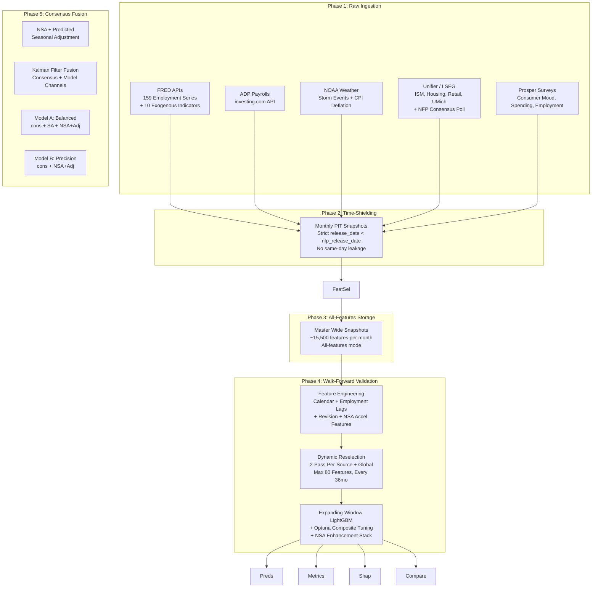

# NFP Predictor

An institutional-grade machine learning pipeline for forecasting U.S. Non-Farm Payrolls (NFP) month-over-month employment changes. Built on LightGBM with expanding-window walk-forward validation, consensus-anchored Kalman fusion, and multimodal data sources (FRED, ADP, NOAA, Unifier, Prosper).

The system produces **two final predictions** per month via Kalman filter fusion:

| Model | Strengths | Full MAE | Full AccelAcc | 36m AccelAcc |
|-------|-----------|----------|---------------|--------------|
| **Model A (Balanced)** | Best acceleration accuracy | 105.9 | 56.9% | 54.3% |
| **Model B (Precision)** | Best MAE/RMSE | 95.5 | 53.4% | 40.0% |
| Consensus (baseline) | — | 109.7 | 44.8% | 42.9% |

Both models beat consensus on the full 59-month OOS backtest. The user selects based on whether **catching turning points** (Model A) or **minimizing absolute error** (Model B) is the priority.

The architecture is explicitly designed around **point-in-time (PIT) correctness**, **dynamic feature selection**, and **consensus-anchored fusion** to prevent lookahead bias and adapt to structural regime changes.

---

## Table of Contents

1. [The NFP Challenge: Why This is Hard](#1-the-nfp-challenge-why-this-is-hard)
2. [System Architecture](#2-system-architecture)
3. [Quickstart](#3-quickstart)
4. [Repository Structure](#4-repository-structure)
5. [Point-In-Time (PIT) Data Integrity](#5-point-in-time-pit-data-integrity)
6. [Data Sources — Deep Dive](#6-data-sources--deep-dive)
   - [6.1 FRED Employment](#61-fred-employment)
   - [6.2 FRED Exogenous](#62-fred-exogenous)
   - [6.3 ADP Employment](#63-adp-employment)
   - [6.4 NOAA Storm Events](#64-noaa-storm-events)
   - [6.5 LSEG Unifier](#65-lseg-unifier)
   - [6.6 Prosper Consumer Sentiment](#66-prosper-consumer-sentiment)
7. [Feature Selection Engine](#7-feature-selection-engine)
   - [7.0 Stage 0: Variance Filter](#70-stage-0-variance-filter)
   - [7.1 Stage 1: Dual Filter](#71-stage-1-dual-filter)
   - [7.2 Stage 2: Boruta](#72-stage-2-boruta)
   - [7.3 Stage 3: Vintage Stability](#73-stage-3-vintage-stability)
   - [7.4 Stage 4: Cluster Redundancy](#74-stage-4-cluster-redundancy)
   - [7.5 Stage 5: Interaction Rescue](#75-stage-5-interaction-rescue)
   - [7.6 Stage 6: Sequential Forward Selection](#76-stage-6-sequential-forward-selection)
8. [Master Snapshot Aggregation](#8-master-snapshot-aggregation)
9. [Training Pipeline — Deep Dive](#9-training-pipeline--deep-dive)
   - [9.1 Data Loading](#91-data-loading)
   - [9.2 Feature Engineering](#92-feature-engineering)
   - [9.3 Expanding Window Backtest](#93-expanding-window-backtest)
   - [9.4 Dynamic Feature Selection](#94-dynamic-feature-selection)
   - [9.5 NSA Acceleration Features for SA](#95-nsa-acceleration-features-for-sa)
   - [9.6 Branch-Target Feature Selection](#96-branch-target-feature-selection)
   - [9.7 Sample Weighting](#97-sample-weighting)
   - [9.8 Model Training (LightGBM)](#98-model-training-lightgbm)
   - [9.9 Hyperparameter Tuning (Optuna)](#99-hyperparameter-tuning-optuna)
   - [9.10 Variance Enhancement Stack](#910-variance-enhancement-stack)
   - [9.11 Prediction Intervals](#911-prediction-intervals)
   - [9.12 Baselines and Keep Rule](#912-baselines-and-keep-rule)
10. [Variance Capture Metrics](#10-variance-capture-metrics)
11. [Model Variants](#11-model-variants)
12. [Running the Pipeline](#12-running-the-pipeline)
13. [Configuration Reference](#13-configuration-reference)
14. [Output Artifacts](#14-output-artifacts)
15. [Consensus Anchor Fusion (Post-Training)](#15-consensus-anchor-fusion-post-training)
16. [Reproducibility](#16-reproducibility)
17. [Testing and Linting](#17-testing-and-linting)
18. [Economic Shock Handling](#18-economic-shock-handling)
19. [Troubleshooting](#19-troubleshooting)

---

## 1. The NFP Challenge: Why This is Hard

Forecasting NFP is notoriously difficult for quantitative models due to four structural realities:

1. **Aggressive Revisions:** The initial Bureau of Labor Statistics (BLS) release is heavily revised in subsequent months. Models trained naively on "finalized" historical data will suffer severe lookahead bias by assuming they had clean data that didn't exist in real-time.
2. **Asynchronous Availability:** Economic indicators are published at mismatched frequencies (daily, weekly, monthly) with varying lag times (e.g., NOAA storm data arrives ~75 days late). Aligning these without peeking into the future requires rigorous data versioning.
3. **Regime Non-Stationarity:** The economy fundamentally breaks its own rules. Relationships that held during the "Great Moderation" (pre-2008) often decoupled or inverted during the Global Financial Crisis (GFC) or the 2020 COVID-19 shock.
4. **High-Dimensional Instability:** Thousands of macroeconomic series contain spurious or transient correlations. Without temporally-aware feature selection, complex models will catastrophically overfit to this noise.

---

## 2. System Architecture



---

## 3. Quickstart

### Prerequisites

- Python 3.10+
- On macOS, LightGBM requires OpenMP: `brew install libomp`

### Install

```bash
pip install -r requirements.txt
```

For development tools (linting, pre-commit):

```bash
pip install -e ".[dev]"
pre-commit install
```

### Configure environment

Copy the template and fill in your credentials:

```bash
cp .env .env.local    # or edit .env directly — it is not committed to git
```

Required variables in `.env`:

| Variable | Description |
|---|---|
| `FRED_API_KEY` | FRED API key (required) |
| `UNIFIER_USER` | Unifier API username (required) |
| `UNIFIER_TOKEN` | Unifier API token (required) |
| `DATA_PATH` | Path to data directory (default: `./data`) |
| `START_DATE` | Training start date (e.g. `1990-01-01`) |
| `BACKTEST_MONTHS` | Number of backtest months (e.g. `36`) |

Optional: `END_DATE`, `MODEL_TYPE`, `TARGET_TYPE`, `OUTPUT_DIR` (default `_output`), `TEMP_DIR` (default `_temp`), `DEBUG`, `REFRESH_CACHE`, `RESELECT_EVERY_N_MONTHS` (default `6`).

### Smoke test

```bash
# Verify environment is configured and directories are accessible
python settings.py

# Run the test suite
pytest tests/ -v
```

---

## 4. Repository Structure

```
NFP_Predictor/
├── settings.py                          # Central config: env vars, paths, logger factory
├── run_full_project.py                  # Pipeline orchestrator (data → master snapshots → train)
├── analyze_seasonal_adjustment.py       # SARIMA seasonal adjustment analysis
│
├── Data_ETA_Pipeline/                   # Phase 1–3: Ingestion, PIT snapshots, feature selection
│   ├── fred_employment_pipeline.py      # FRED employment series (NSA + SA, ALFRED vintage)
│   ├── load_fred_exogenous.py           # FRED exogenous series (weekly jobless claims, VIX, etc.)
│   ├── adp_pipeline.py                  # ADP payroll snapshots from investing.com
│   ├── noaa_pipeline.py                 # NOAA weather data (75-day lag modelling + CPI deflation)
│   ├── load_unifier_data.py             # Unifier survey data (vendor timestamp repair)
│   ├── load_prosper_data.py             # Prosper consumer sentiment surveys
│   ├── feature_selection_engine.py      # 6-stage regime-aware feature selection
│   ├── create_master_snapshots.py       # Aggregates all sources → master parquets
│   ├── nfp_release_calendar.py          # BLS NFP release date calendar (first Friday rule)
│   ├── perf_stats.py                    # Performance profiling decorators + JSON dumps
│   ├── perf_summary.py                  # Performance summary utilities
│   ├── utils.py                         # ETL utilities (snapshot paths, MultiIndex helpers)
│   ├── test_feature_selection.py        # Feature selection tests
│   └── analyze_noaa_weights_vintage.py  # NOAA weighting analysis
│
├── Train/                               # Phase 4–5: Model training and output
│   ├── train_lightgbm_nfp.py            # Main entrypoint: expanding-window backtest
│   ├── config.py                        # Hyperparameters, paths, valid target configs
│   ├── data_loader.py                   # Master snapshot loading + pivot_snapshot_to_wide()
│   ├── feature_engineering.py           # Calendar, survey-week, employment lag features
│   ├── model.py                         # LightGBM fit/predict helpers (safe wrappers)
│   ├── hyperparameter_tuning.py         # Optuna tuning with inner TimeSeriesSplit
│   ├── baselines.py                     # Naive baselines (prior month, rolling mean)
│   ├── candidate_pool.py                # Union of feature-selection survivors (cached)
│   ├── short_pass_selection.py          # Per-step top-K feature filter (walk-forward)
│   ├── branch_target_selection.py       # Branch-target derived feature selection
│   ├── revision_features.py             # Revision-specific feature construction
│   ├── variance_metrics.py              # Variance KPIs and composite objective
│   ├── selected_features/               # Per-source, per-track selected feature JSONs
│   └── Output_code/                     # Output generation modules
│       ├── model_comparison.py          # Multi-variant scorecard (CSV + styled HTML)
│       ├── generate_output.py           # Orchestrates all output artefacts
│       ├── metrics.py                   # RMSE, MAE, coverage calculations
│       ├── plots.py                     # Backtest, SHAP, and diagnostic plots
│       ├── feature_importance.py        # Gain-based importance analysis
│       └── consensus_anchor_runner.py   # Post-training Kalman/consensus fusion
│
├── scripts/                             # Utility / diagnostic scripts
│   ├── predict_next_nfp.py              # Production inference: next-month prediction + intervals
│   ├── check_data_freshness.py          # Verify data is up-to-date before release day
│   ├── benchmark_keep_rule.py           # Run keep-rule benchmark reports
│   ├── directional_accuracy.py          # Directional hit-rate analysis
│   └── revision_analysis.py             # NFP revision autocorrelation analysis
│
├── utils/                               # Shared utilities
│   ├── transforms.py                    # SymLog, COVID winsorization, Z-score helpers
│   ├── paths.py                         # Cross-platform path helpers
│   └── benchmark_harness.py             # A/B timing harness for algorithm comparisons
│
├── tests/                               # pytest test suite
├── notebooks/                           # Per-source feature analysis notebooks (NSA track)
├── revised_notebooks/                   # Per-source feature analysis notebooks (SA/revised track)
│
├── data/                                # Data root (not committed; set via DATA_PATH)
│   ├── fred_data/decades/               # Raw FRED vintage snapshots
│   ├── fred_data_prepared_{nsa,sa}/     # Prepared FRED employment snapshots
│   ├── Exogenous_data/                  # Per-source parquets (ADP, NOAA, Unifier, Prosper, FRED exog)
│   ├── master_snapshots/{nsa,sa}/       # Feature-selected master snapshots
│   └── NFP_target/                      # Target parquets (total_nsa_first_release.parquet, etc.)
│
├── _output/                             # Pipeline output artefacts
├── _temp/                               # Logs and performance profiling JSON files
│
├── requirements.txt
├── pyproject.toml                       # Build config, ruff lint rules, pytest settings
└── .github/workflows/test.yml           # CI: pytest × Python 3.10–3.12, ruff, mypy
```

---

## 5. Point-In-Time (PIT) Data Integrity

**Target:** Month-over-month change in U.S. Non-Farm Payrolls (`y_mom`). The once-revised MoM (from the M+1 FRED snapshot) is the primary ground-truth target.

**Fundamental constraint:** Every feature `X_i` mapped to prediction month `t` must satisfy:

```
feature_release_date < target_release_date(t)
```

This strict inequality (`<`, not `<=`) prevents same-day leakage, meaning even data published on the exact day of the NFP release is excluded.

### How PIT is enforced per source

| Source | Mechanism | Detail |
|---|---|---|
| **FRED Employment** | ALFRED vintage snapshots | `realtime_start` tracks when each data revision became public. Missing pre-2009 release dates use heuristic imputation based on first-Friday logic or complex 3-tier gate system. |
| **FRED Exogenous** | Vintage backfill + NFP-windowed weekly aggregation | Weekly claims data (CCNSA, CCSA) is bucketed using NFP release windows, not calendar months: data released between `NFP(M-1)` and `NFP(M)` goes into month M. |
| **ADP** | `release_date < nfp_release_date` | Strict inequality filter on ADP publication dates. |
| **NOAA** | 75-day lag model | Storm data modelled as `month-end + 75 days` (NCEI documented standard). Optional NFP-relative adjustment. |
| **Unifier** | Median publication lag repair | Unifier API overwrites `first_release_date` with `timestamp` when the field is missing, causing lookahead bias. Repaired by computing per-series `median_lag_days` from historical data with valid release dates, then backfilling. |
| **Prosper** | `release_date < nfp_release_date` | Strict inequality filter on survey publication dates. |

### Release Date Imputation (FRED Employment)

For historical FRED data where `realtime_start` is unavailable (pre-2009), two imputation strategies are used:

1. **First-release files** (`impute_target_release_date_simple`): Simple first-Friday-of-month logic.
2. **Last-release files** (`impute_target_release_date_complex`): Complex 3-tier gate system:
   - **Option 1:** Extended backfill for very old data (pre-2009) where no release metadata exists.
   - **Option 2:** Intermediate backfill for series with partial metadata.
   - **Option 3:** Closest candidate respecting snapshot timing constraints.

---

## 6. Data Sources — Deep Dive

### 6.1 FRED Employment

**File:** `Data_ETA_Pipeline/fred_employment_pipeline.py`

**Purpose:** The core employment target variable (NFP itself) and 159 disaggregated employment series organized in a 7-level hierarchy.

**Hierarchy:**

```
Level 0: Total (NSA + SA)
Level 1: Private vs Government
Level 2: Goods-Producing vs Service-Providing (private); Federal / State / Local (govt)
Level 3: Mining & Logging, Construction, Manufacturing, Trade, Financial, Professional, etc.
Level 4+: Sub-industry breakdowns (e.g., Durable Goods, Food Services, Health Care)
```

**Key mechanics:**

- **159 FRED series** are defined in the `FRED_EMPLOYMENT_CODES` dictionary, mapping hierarchical names to FRED series IDs.
- **ALFRED vintage downloads:** `_fetch_one_all_asof()` fetches each series with full revision history via the Federal Reserve's ALFRED API, preserving `realtime_start` metadata.
- **BLS schedule scraping:** `scrape_bls_employment_situation_schedule()` scrapes the BLS website for the official NFP release schedule. Falls back to `HARDCODED_RELEASE_DATES` for known-but-not-yet-published dates.
- **NFP timing utilities (cached):** `get_nfp_release_for_month()` and `get_nfp_release_map()` return the exact release date for each target month. `calculate_median_offset_from_nfp()` computes the typical lag between a series' release and the NFP release.
- **Audit alignment:** `_align_audit_to_total_calendar()` aligns all series' `realtime_start` dates to the `total_nsa` release calendar, ensuring consistent timing across the hierarchy.

**Per-series feature engineering (9 features each):**

For each of the 159 employment series, the pipeline computes:

| Feature | Formula | Purpose |
|---|---|---|
| `_latest` | Raw level value | Current employment level |
| `_MoM` | `level[t] - level[t-1]` | Month-over-month absolute change |
| `_MoM_pct` | `(level[t] - level[t-1]) / level[t-1]` | Month-over-month percentage change |
| `_3m` | `level[t] - level[t-3]` | 3-month change |
| `_6m` | `level[t] - level[t-6]` | 6-month change |
| `_YoY` | `level[t] - level[t-12]` | Year-over-year change |
| `_12m_pct_change` | `(level[t] - level[t-12]) / level[t-12]` | Year-over-year percentage change |
| `_rolling_3m` | `mean(MoM[t], MoM[t-1], MoM[t-2])` | 3-month rolling mean of MoM |
| `_volatility` | `std(MoM[t:t-3])` | 3-month rolling standard deviation |

This yields approximately **159 × 9 = 1,431 employment features** per snapshot.

**Target files produced:**

```
DATA_PATH/NFP_target/total_nsa_first_release.parquet   # NSA first release (primary target)
DATA_PATH/NFP_target/total_sa_first_release.parquet    # SA first release
DATA_PATH/NFP_target/y_nsa_revised.parquet             # NSA revised (once-revised MoM from M+1)
DATA_PATH/NFP_target/y_sa_revised.parquet              # SA revised
```

**Snapshot directory structure:**

```
DATA_PATH/fred_data/decades/{decade}s/{year}/{YYYY-MM}.parquet            # Raw
DATA_PATH/fred_data_prepared_{nsa|sa}/decades/{decade}s/{year}/{YYYY-MM}.parquet  # Prepared
```

---

### 6.2 FRED Exogenous

**File:** `Data_ETA_Pipeline/load_fred_exogenous.py`

**Purpose:** Macroeconomic indicator snapshots synchronized with NFP release dates — financial stress, oil, yields, volatility, and weekly jobless claims.

**Series (10 indicators):**

| Series | FRED ID | Frequency | Description |
|---|---|---|---|
| Credit Spreads | BAMLH0A0HYM2 | Daily | High-yield corporate bond spread (risk appetite proxy) |
| Yield Curve | T10Y2Y | Daily | 10Y-2Y Treasury spread (recession predictor) |
| Oil Prices | DCOILWTICO | Daily | WTI crude oil (energy sector signal) |
| VIX | VIXCLS | Daily | CBOE Volatility Index (market fear gauge) |
| S&P 500 | — (Yahoo Finance) | Daily | Equity market level (FRED only has data from 2016+) |
| Financial Stress | STLFSI4 | Weekly | St. Louis Fed Financial Stress Index |
| Weekly Economic Index | WEI | Weekly | NY Fed Weekly Economic Index |
| Continued Claims (NSA) | CCNSA | Weekly | Ongoing unemployment claims (not seasonally adjusted) |
| Continued Claims (SA) | CCSA | Weekly | Ongoing unemployment claims (seasonally adjusted) |

**Binary regime indicators (NOT differenced):**

These are computed from the raw series but excluded from standard differencing/pct_change pipelines because their binary nature makes such transforms meaningless:

- `VIX_panic_regime`: VIX > 40
- `VIX_high_regime`: VIX > 25
- `SP500_bear_market`: S&P 500 drawdown > 20%
- `SP500_crash_month`: S&P 500 monthly return < -10%
- `SP500_circuit_breaker`: S&P 500 daily drop > 7%

**Weekly claims aggregation (NFP-windowed):**

Weekly data (CCNSA, CCSA, WEI) requires special handling. Calendar-month aggregation would leak future information because some weeks span month boundaries. Instead:

```python
# Data released between NFP(M-1) and NFP(M) goes into month M bucket
aggregate_weekly_to_monthly_nfp_based(weekly_df, nfp_release_map)
```

This respects the actual publication schedule. A claim reported on January 15th (after the January NFP release on January 10th) goes into February's bucket, matching what an analyst would actually have in hand.

**Spike statistics:** `calculate_weekly_spike_stats()` captures extreme weekly spikes (e.g., the March 2020 COVID unemployment claims explosion) as separate features, since standard monthly aggregation would dilute the signal.

**API resilience:** `fred_api_call_with_retry()` uses exponential backoff (2s, 4s, 8s) with thread-safe rate limiting at 0.8s per request via `_rate_limited_fetch()`.

**Output:**

```
DATA_PATH/Exogenous_data/exogenous_fred_data/decades/{decade}s/{year}/{YYYY-MM}.parquet
```

---

### 6.3 ADP Employment

**File:** `Data_ETA_Pipeline/adp_pipeline.py`

**Purpose:** Alternative private-sector employment measure from ADP (via investing.com API), providing an independent signal from the BLS establishment survey.

**Data source:** investing.com REST API (event_id=1), returning ADP National Employment Change in thousands — already native-aligned with NFP's unit of measurement.

**Pipeline:**

1. **`fetch_adp_from_api()`** — Pulls historical event occurrences with `actual` reported values. Captures both `date` (reference period) and `release_date` (publication date). Historical data back to ~2001.
2. **`create_adp_snapshots()`** — Creates PIT snapshots:
   - Strict filter: `release_date < nfp_release_date` (no same-day leakage)
   - Keeps the most recent (freshest) ADP value for each reference month
   - Applies feature transforms: `pct_change`, `compute_all_features()` in lean mode (no symlog — tree-invariant)
3. **`validate_snapshots()`** — Post-creation validation confirms no PIT violations exist

**Output:**

```
DATA_PATH/Exogenous_data/ADP_data/ADP_Employment_Change.parquet          # Raw
DATA_PATH/Exogenous_data/ADP_snapshots/decades/{decade}s/{year}/{YYYY-MM}.parquet  # Snapshots
```

---

### 6.4 NOAA Storm Events

**File:** `Data_ETA_Pipeline/noaa_pipeline.py`

**Purpose:** Economic impact of severe weather events, inflation-adjusted to present-day dollars. Natural disasters are a real but undermodeled source of NFP volatility (construction shutdowns, service disruptions).

**Pipeline stages:**

1. **Download & parse:** Downloads StormEvents_details CSV files (gzip) from NCEI. `parse_damage_value()` converts BLS-style strings ("25K", "1.5M", "0") to dollar amounts. `add_begin_datetime_column()` constructs event timestamps from `BEGIN_YEARMONTH`, `BEGIN_DAY`, `BEGIN_TIME`.

2. **State-level aggregation:** Aggregates events by state and month:
   - `total_damage_real` = property + crop damage (CPI-adjusted via `CPIAUCSL` from FRED)
   - `property_damage_real` / `crop_damage_real` (CPI-adjusted separately)
   - `deaths_direct` / `deaths_indirect` / `injuries_direct` / `injuries_indirect`

3. **Employment-weighted national aggregation:** `create_noaa_weighted_snapshots()` builds state-to-national aggregates weighted by each state's share of total non-farm employment. This ensures that a Category 5 hurricane hitting Texas (large employment share) contributes more than the same storm hitting Wyoming.

4. **Release date modeling:** `calculate_noaa_release_date()` applies a 75-day lag after month-end (NCEI's documented processing delay). Optional NFP-relative adjustment via `apply_nfp_relative_adjustment()`.

**Output:**

```
DATA_PATH/Exogenous_data/NOAA_data/{STATE}_NOAA_data.parquet             # Per-state
DATA_PATH/Exogenous_data/NOAA_data/US_NOAA_data.parquet                  # National
DATA_PATH/Exogenous_data/NOAA_data/NOAA_master.parquet                   # Master (long-format)
DATA_PATH/Exogenous_data/exogenous_noaa_snapshots/decades/.../*.parquet  # PIT snapshots
```

---

### 6.5 LSEG Unifier

**File:** `Data_ETA_Pipeline/load_unifier_data.py`

**Purpose:** Leading economic indicators from the Unifier / LSEG API — ISM surveys, housing, retail sales, consumer confidence, and the critical NFP consensus poll.

**Series (11 indicators):**

| Series | Unifier Code | Description |
|---|---|---|
| ISM Manufacturing Index | USNAPMEM | Factory sector expansion/contraction |
| ISM Non-Manufacturing Index | USNPNE..Q | Services sector expansion/contraction |
| CB Consumer Confidence | USCNFCONQ | Conference Board consumer survey |
| Avg Weekly Hours (All Private) | — | Leading indicator of labor demand |
| Avg Weekly Hours (Manufacturing) | — | Manufacturing-specific labor signal |
| Avg Hourly Earnings (Private) | — | Wage tightness indicator |
| Housing Starts | USHOUSE.O | Residential construction activity |
| Retail Sales | USRETTOTB | Consumer spending (100% release date completeness) |
| Empire State Mfg Survey | USFRNFMFQ | Regional PMI (first released each month) |
| UMich Consumer Expectations | — | Forward-looking consumer sentiment |
| Industrial Production | USIPTOT.G | Total industrial output |
| **NFP Consensus Poll** | — | LSEG/Reuters economists' mean NFP forecast |

**Critical PIT issue and fix:**

The Unifier API has a data integrity bug: when `first_release_date` is missing for a data point, the system incorrectly fills `last_revision_date` with the API call's `timestamp` (today's date). If used naively, this would make historical data appear to have been available today — catastrophic lookahead bias.

**Solution:** `get_effective_release_and_value_vectorized()`:
- **Case 1:** Missing `first_release_date` → NEVER use `last_revision_date`; instead, backfill using the series' empirical `median_lag_days` (computed from observations where `first_release_date` is present).
- **Case 2:** Has `first_release_date` → Use the most recent value available before the snapshot date.
- **All cases:** Strict `<` inequality: `release_date < snap_date`.

**Zero-centered series:** Empire State Manufacturing and Challenger Job Cuts are naturally zero-centered (positive = expansion, negative = contraction). The `ZERO_CENTERED_SERIES` constant ensures that `pct_change` is skipped for these (as it would be meaningless or undefined around zero).

**NFP consensus:** `_fetch_consensus_series()` fetches the Reuters/LSEG economists' mean NFP forecast. Release date is set to the last day of the month (consensus is finalized before the NFP release).

**Output:**

```
DATA_PATH/Exogenous_data/exogenous_unifier_data/decades/{decade}s/{year}/{YYYY-MM}.parquet
```

---

### 6.6 Prosper Consumer Sentiment

**File:** `Data_ETA_Pipeline/load_prosper_data.py`

**Purpose:** Monthly consumer survey data measuring mood, spending intentions, and employment expectations — leading indicators that often foreshadow labor market shifts.

**Top predictors:**
- Prosper Consumer Spending Forecast
- Consumer Mood Index
- Employment environment expectations
- Employment status breakdowns

**Survey demographics:** US 18+, 18-34, Males, Females

**Key mechanics:**

- **Parallel fetching:** `fetch_single_key()` with rate limiting (max 10 requests/sec).
- **Retired question filtering:** `filter_unwanted_series()` removes discontinued survey questions (e.g., "I am retired").
- **Employment series merge:** `merge_employment_series()` solves a historical multicollinearity problem:
  - Pre-September 2009: Single "I am employed" question.
  - Post-September 2009: Split into "full-time" + "part-time".
  - The pipeline merges both into a continuous "I am employed" feature (FT + PT), avoiding a structural break in the time series.
- **PIT filtering:** `release_date < nfp_release_date` (strict inequality).

**Output:**

```
DATA_PATH/Exogenous_data/prosper/decades/{decade}s/{year}/{YYYY-MM}.parquet
```

---

## 7. Feature Selection Engine

**File:** `Data_ETA_Pipeline/feature_selection_engine.py`

The feature selection engine is a 7-stage pipeline (Stages 0–6) designed to reduce the massive feature space (~17k+ from FRED employment alone) to a tractable set while preserving genuine predictive signal. It runs independently per data source and per historical regime, with results cached to support incremental reruns.

**Default pipeline:** Stages (0, 1, 2, 3, 4) — omits Stages 5 and 6, whose signal is redundant with the train-time short-pass selection that re-derives features every backtest step.

**LightGBM safety helpers used throughout:**
- `_sanitize_lgb_col_name()` — Removes JSON-forbidden characters (`[]{}:,"` etc.)
- `_get_lgb_column_schema()` — Caches sanitization (max 4,096 entries)
- `_prepare_lgb_frame()` — Aligns columns without copying data
- `_safe_lgb_fit()` / `_safe_lgb_predict()` — Preserve column mapping through training and prediction

**LightGBM parameters (feature selection context):**
```python
LGB_PARAMS = {
    'objective': 'regression',
    'metric': 'l2',
    'n_estimators': 100,
    'learning_rate': 0.05,
    'num_leaves': 31,
    'n_jobs': 1,       # macOS + ProcessPoolExecutor + n_jobs=-1 = OOM deadlock
    'random_state': 42,
}
```

---

### 7.0 Stage 0: Variance Filter

**Function:** `_variance_filter()`

**Purpose:** Remove near-constant features where ≥97% of non-NaN values are identical. These provide no information gain for tree splits.

**Two-tier approach for efficiency on large feature sets:**

- **Tier 1 (fast):** `nunique()` classification:
  - `nunique ≤ 1` → constant → **drop**
  - `nunique > 5` → variable → **keep** (impossible for 97% to be one value)
  - `nunique 2–5` → ambiguous → pass to Tier 2
- **Tier 2 (exact):** `np.unique()` per-column for the ambiguous set, computing the exact mode frequency.

**Minimum observations:** Requires at least 30 non-NaN values per column.

**Pre-screen (>5,000 features):** When a source has more than 5,000 features (e.g., FRED Employment at ~17k), Stage 0 includes a vectorized Spearman pre-screen with BH-FDR α=0.30. This reduces Stage 1 input by ~78%, cutting runtime from ~10+ minutes to ~2 minutes with zero empirical signal loss.

---

### 7.1 Stage 1: Dual Filter

Two independent signals are combined: statistical correlation and tree-based importance.

**A) Purged Expanding Correlation**

**Function:** `_purged_expanding_corr()` + `_deduplicate_group()`

Computes the relationship between each feature and the target using expanding (not rolling) windows with a purge gap:

```
weighted_corr = mean(correlations, weights = sqrt(window_sizes))
```

- **3-month purge gap** between training and evaluation windows prevents information leakage across adjacent time points.
- **Expanding windows** (not rolling) with multiple evaluation points handle staggered start dates (FRED starts ~1948, ADP starts ~2010).
- **Weighting:** Larger windows get more weight via `sqrt(window_size)`.

**Deduplication via Hierarchical Clustering:**
- Spearman correlation matrix computed (correlation threshold = 0.95)
- Agglomerative clustering with average linkage
- From each cluster, the feature with highest target correlation is kept
- **Chunked processing** for massive groups (>5,000 features):
  - Phase 1: Chunk dedup locally (within chunks)
  - Phase 2: Iterative merge with shuffling to expose cross-chunk correlations

**B) Random Subspace LightGBM:**
Trains models on random feature subsets to capture non-linear importance that correlation alone would miss.

---

### 7.2 Stage 2: Boruta

**Purpose:** Shadow-feature randomized permutation test (100 runs) to identify features that are genuinely more important than random noise.

**Algorithm:**
1. For each of 100 iterations, create "shadow features" by randomly permuting each real feature's values.
2. Train LightGBM on real + shadow features together.
3. Record the maximum importance among all shadow features (the "shadow max").
4. A real feature is "confirmed" if its importance exceeds the shadow max in a statistically significant number of iterations (binomial test).

**Guard:** Maximum 500 features passed to Boruta to prevent memory explosion on very wide datasets.

---

### 7.3 Stage 3: Vintage Stability

**Purpose:** Reject features whose predictive relationship with the target has structurally shifted over time. A feature that was highly correlated with NFP in 2005 but uncorrelated since 2020 is unstable and unreliable.

**Mechanism:** Exponential recency weighting across hard-coded macroeconomic regimes:

| Regime | Start Date | Description |
|---|---|---|
| Pre-GFC Great Moderation | 1998-01-01 | Stable macro environment |
| GFC Shock + Repair | 2008-01-01 | Financial crisis and recovery |
| Late-Cycle Long Expansion | 2015-01-01 | Extended post-GFC expansion |
| COVID Shock + Great Resignation | 2020-03-01 | Pandemic disruption |
| Inflation Tightening & Soft Landing | 2022-03-01 | Fed rate hike cycle |
| AI and Trump Era | 2025-02-01 | Current regime |

**Recency windows:**
- Default: 3 months
- NOAA: 6 months (weather data is inherently noisier)

Features must maintain stable predictive power across recent regimes to pass this stage.

---

### 7.4 Stage 4: Cluster Redundancy

**Purpose:** Collapse groups of collinear survivors into single representatives, reducing redundancy without losing coverage.

**Method:** NaN-aware Spearman hierarchical clustering.

The key innovation is NaN-awareness: since different features have different historical coverage (FRED starts 1948, ADP starts 2001, Prosper starts 2009), standard Pearson/Spearman correlation would either drop most rows or produce unreliable estimates. The NaN-aware implementation computes pairwise correlations using only the overlapping non-NaN periods for each pair.

From each cluster, the feature with the strongest target correlation is retained.

---

### 7.5 Stage 5: Interaction Rescue (Optional)

**Purpose:** Recover features that appear individually weak but interact powerfully with other features or the target.

**Two-phase detection:**
1. **Single-feature interactions:** Features whose importance jumps when combined with specific other features.
2. **Split-pair interactions:** Pairs of features that, when split on jointly, reveal structure invisible in marginal analysis.

Omitted from the default pipeline (Stage 5 is redundant with train-time short-pass selection).

---

### 7.6 Stage 6: Sequential Forward Selection (Optional)

**Purpose:** Walk-forward cross-validation with embargo to greedily build the optimal feature subset.

**Algorithm:** Starting with an empty set, iteratively add the feature that most improves out-of-sample prediction accuracy (with an embargo period between train and test to prevent leakage). Stop when adding features yields diminishing returns.

Omitted from the default pipeline (computationally expensive, redundant with train-time selection).

---

### Feature Selection Caching

Results are cached at three levels to support incremental reruns:

| Cache | Location | TTL | Key |
|---|---|---|---|
| Per-source | `source_caches/source_{source}_{target}_{source}.json` | 30 days | Source name + target config |
| Per-regime | `regime_caches/selected_features_{target}_{source}_{cutoff}.json` | 30 days | Cutoff month |
| Branch-level | `selected_features_{target_type}_{target_source}.json` | 30 days | Branch mode |

Cache version: `"2026-02-24-regime-cache-v1"`.

---

## 8. Master Snapshot Aggregation

**File:** `Data_ETA_Pipeline/create_master_snapshots.py`

**Purpose:** Combine all 7 source-specific snapshot directories into a single wide-format `.parquet` file per month, with automatic feature selection applied.

**Source directories:**

```python
SOURCES = {
    'FRED_Employment_NSA': DATA_PATH / "fred_data_prepared_nsa" / "decades",
    'FRED_Employment_SA':  DATA_PATH / "fred_data_prepared_sa" / "decades",
    'FRED_Exogenous':      DATA_PATH / "Exogenous_data" / "exogenous_fred_data" / "decades",
    'Unifier':             DATA_PATH / "Exogenous_data" / "exogenous_unifier_data" / "decades",
    'ADP':                 DATA_PATH / "Exogenous_data" / "ADP_snapshots" / "decades",
    'NOAA':                DATA_PATH / "Exogenous_data" / "exogenous_noaa_snapshots" / "decades",
    'Prosper':             DATA_PATH / "Exogenous_data" / "prosper" / "decades",
}
```

**Target combos:**

```python
TARGET_COMBOS = [('nsa', 'revised'), ('sa', 'revised')]
```

**Feature selection target modes:**

| Mode | Use Case | Description |
|---|---|---|
| `'mom'` | NSA targets | Feature selection target = month-over-month change |
| `'delta_mom'` | — | Change in MoM (acceleration) |
| `'model_aligned'` | SA targets | Blended objective: level (0.30) + MoM_diff (0.55) + direction (0.15) |

**Data start floor:** `1990-01-01` — Pre-1990 data is extremely sparse for non-FRED sources and degrades selection quality.

**Execution order (by runtime):**
1. FRED_Employment_NSA
2. FRED_Employment_SA
3. FRED_Exogenous
4. Unifier
5. Prosper
6. NOAA
7. ADP

**Feature selection stages (configurable via `NFP_FS_STAGES` env var):**
- Default: `(0, 1, 2, 3, 4)` — ~5 min/source
- Fast: `NFP_FS_STAGES="0,1,4"` — ~3 min/source
- Full: `NFP_FS_STAGES="0,1,2,3,4,5,6"` — ~10 min/source

**Output:**

```
DATA_PATH/master_snapshots/{nsa|sa}/revised/decades/{decade}s/{year}/{YYYY-MM}.parquet
```

---

## 9. Training Pipeline — Deep Dive

### 9.1 Data Loading

**File:** `Train/data_loader.py`

The data loader bridges ETL output to training input. Key functions:

**`load_master_snapshot(target_month, target_type, target_source)`** — Loads the pre-merged, feature-selected wide-format parquet for a given month. Results are cached in a module-level `_snapshot_cache` dictionary to avoid redundant I/O during the expanding-window backtest.

**`load_target_data(target_type, release_type, target_source)`** — Loads the NFP target series (`y_mom`). For revised targets, reads the `_audit_asof_*.parquet` files to determine boundary vintage availability.

**`pivot_snapshot_to_wide(snapshot_df)`** — Converts long-format source snapshots to wide-format training features. Feature names are sanitized (replacing `%`, `+`, `[`, `]`, etc.) for LightGBM compatibility.

**`batch_lagged_target_features(y_series, months)`** — Vectorized computation of lagged target features. For each snapshot month, computes 9 derived features from the target itself (latest, MoM, MoM%, 3m, 6m, YoY, 12m_pct, rolling_3m, volatility).

**NOAA staleness handling:** Since NOAA data arrives ~75 days late, a forward-fill of up to `NOAA_MAX_FFILL_MONTHS = 6` months is applied, with a staleness indicator (`__staleness_months`) feature tracking how stale the data is.

**NaN philosophy:** No imputation. LightGBM handles NaN natively via its split-finding algorithm. Different features have different start dates (FRED ~1948, ADP ~2001, Prosper ~2009), and forcing imputation would introduce artificial patterns.

---

### 9.2 Feature Engineering

**File:** `Train/feature_engineering.py`

Calendar and structural features that capture BLS-specific timing patterns:

**Cyclical encoding (preserves December → January proximity):**

```
month_sin = sin(2π × month / 12)
month_cos = cos(2π × month / 12)
quarter_sin = sin(2π × quarter / 4)
quarter_cos = cos(2π × quarter / 4)
```

This is superior to one-hot encoding for tree models because it represents the circular nature of time — December (month 12) is mathematically adjacent to January (month 1).

**Survey interval features:**

The BLS defines the NFP reference week as the pay period containing the 12th of the month. The function `get_survey_week_date()` finds the Sunday beginning that week, and `calculate_weeks_between_surveys()` computes the gap:

```
weeks_since_last_survey = days_between_12ths / 7   (typically 4 or 5)
is_5_week_month = 1 if weeks_since_last_survey == 5 else 0
```

This is critical for NSA prediction: a 5-week interval allows more accumulated job growth/loss between survey periods, systematically inflating NSA counts.

**BLS timing indicators:**
- `is_jan = 1` — January: BLS updates seasonal adjustment factors (structural break risk)
- `is_july = 1` — July: Mid-year benchmark revision month
- `year` — Secular trend capture

**SA calendar filtering:** SA series have seasonality stripped by BLS, so month/quarter cyclical encodings and seasonal flags are redundant. Only `weeks_since_last_survey`, `is_5_week_month`, and `year` are kept for SA models (configured via `SA_CALENDAR_FEATURES_KEEP` in `config.py`).

---

### 9.3 Expanding Window Backtest

**File:** `Train/train_lightgbm_nfp.py`

The core of the entire system. The expanding window backtest simulates real-time deployment by marching forward one month at a time:

```
FOR each target_month in [oldest_backtest_month, ..., latest]:
    1. EXPANDING WINDOW: X_train = all data strictly before target_month
    2. FEATURE ENGINEERING: Calendar + employment lags + revision features (parallel via joblib)
    3. DYNAMIC FEATURE SELECTION: If reselection is due (every N months):
         - Pass 1: Per-source selection (stages 0,2,4,5) independently
         - Pass 2: Global cross-source reduction to ≤ 50 features
    4. SHORT-PASS SELECTION: Top-K from candidate pool (LightGBM gain or weighted corr)
    5. HYPERPARAMETER TUNING: Optuna (every TUNE_EVERY_N_MONTHS = 12 months)
    6. MODEL TRAINING: LightGBM on selected features with sample weights
    7. VARIANCE ENHANCEMENTS: Sequential stack (amplitude → shock → dynamics → acceleration → regime)
    8. PREDICTION: Forecast for target_month with confidence intervals
    9. BASELINES: Compute naive baseline predictions
   10. STORE: Result row with prediction, error, intervals, directional accuracy
```

**No time-travel guarantee:**
- Model retrained from scratch each step
- Features strictly from data available BEFORE `target_month`
- Release-date cutoff (not `target_month`) matches real-world data availability
- COVID winsorization applied per-fold (not globally), preventing leakage of the knowledge that COVID happened

**Directional accuracy tracking:**

```
dir_correct    = sign(actual) == sign(prediction)
accel_correct  = sign(Δactual) == sign(Δprediction)
    where Δ = MoM[t] - MoM[t-1]
```

**Output per backtest step:**
```python
result_row = {
    'ds': target_month,
    'actual': actual_value,
    'predicted': predicted_value,
    'error': actual - predicted,
    'lower_50', 'upper_50', 'lower_80', 'upper_80', 'lower_95', 'upper_95',
    'in_50_interval', 'in_80_interval', 'in_95_interval',
    'n_train_samples', 'n_features',
    'dir_correct', 'accel_correct',
    'prediction_strategy',  # 'base', 'amplitude', 'shock', etc.
    'baseline_last_y', 'baseline_last_y_error',
    'baseline_rolling_mean_6', 'baseline_rolling_mean_6_error',
}
```

---

### 9.4 Dynamic Feature Selection

When master snapshots contain ALL lean features (indicated by `mode: "all_features"` in the feature selection cache), dynamic reselection is the sole feature selection path.

**Two-pass architecture:**

**Pass 1 (per-source):** Run feature selection independently on each source's features using stages (0, 1, 2, 4, 5, 6):
- FRED Employment NSA
- FRED Employment SA
- FRED Exogenous
- Unifier
- ADP
- NOAA
- Prosper

**Pass 2 (global):** Combine all Pass-1 survivors plus target-derived features, then reduce to a hard cap of `DYNAMIC_FS_PASS2_MAX_FEATURES = 50` using stages (0, 1, 2, 4).

**Reselection frequency:** Controlled by `RESELECT_EVERY_N_MONTHS` (default: 6), loaded from `.env` via `settings.py`.

**NaN evaluation window:** Features are judged on NaN rate from `2010-01-01` onward. Earlier NaN (from pre-2010 data gaps) is tolerated since many sources simply didn't exist before then. Maximum acceptable NaN rate: 20%.

**Uniform sample weighting for reselection:**
- `RESELECTION_HALF_LIFE_MONTHS = 9999` — Effectively uniform weights (no recency decay), selecting features with durable long-term predictive power
- `RESELECTION_START_DATE = '2000-01-01'` — Only start adaptive reselection when sufficient data exists
- Stage config: Pass 1 uses (0, 2, 4, 5), Pass 2 uses (0, 2, 4)
- `DYNAMIC_FS_PASS2_MAX_FEATURES = 80` — Hard cap after global reduction
- Reselection interval: every 36 months (configurable via `.env`)

---

### 9.5 NSA Acceleration Features for SA

**File:** `Train/nsa_acceleration.py`

When running `--train-all`, the NSA model trains first. Its backtest results are then used to compute 8 PIT-safe acceleration features that are injected into the SA model's training data at each backtest step:

| Feature | Description |
|---------|-------------|
| `nsa_pred_delta` | NSA predicted MoM change: `nsa_pred[t] - actual_nsa[t-1]` |
| `nsa_pred_accel` | NSA predicted acceleration (2nd derivative) |
| `nsa_pred_direction` | Sign of `nsa_pred_delta` |
| `nsa_actual_accel` | Actual NSA acceleration at t-1 (from revised target) |
| `nsa_accel_accuracy_12m` | Rolling 12-month NSA acceleration accuracy (credibility) |
| `nsa_residual_trend_6m` | Slope of NSA residuals (bias drift signal) |
| `nsa_sa_accel_corr_12m` | Rolling correlation of NSA vs SA acceleration (bridge) |
| `nsa_sa_gap_delta` | Change in SA-NSA gap (seasonal adjustment dynamics) |

These features are **always included** (like calendar features) — not subject to dynamic reselection. They bridge the NSA model's acceleration signal into SA space.
```

Features with fewer than 10 valid observations get `corr = 0`. Runtime: milliseconds.

**Configuration:**
- `SHORTPASS_TOPK = 60` — Features selected per step (configurable in 40-80 range)
- `SHORTPASS_METHOD = 'lgbm_gain'` — Default method
- `SHORTPASS_HALF_LIFE = None` — Reuses the backtest step's half-life

---

### 9.6 Branch-Target Feature Selection

**File:** `Train/branch_target_selection.py`

Target-derived features (e.g., `nfp_nsa_MoM`, `nfp_nsa_rolling_3m`) are selected separately from snapshot features and merged on top.

**Redundancy pruning:** Greedy correlation-based pruning with `corr_threshold = 0.90` and `min_overlap = 24` months.

**Ranking methods:**

**A) `weighted_corr`** (used for NSA): Simple weighted absolute correlation with target.

**B) `dynamics_composite`** (used for SA): Multi-signal composite ranking designed to capture variance dynamics:

| Signal | Weight | Formula |
|---|---|---|
| Level correlation | 0.25 | `corr(feature, y)` |
| Delta correlation | 0.25 | `corr(Δfeature, Δy)` |
| Direction separation | 0.15 | `tanh(effect_size)` for sign separation |
| Magnitude correlation | 0.20 | `corr(|Δfeature|, |Δy|)` |
| Sign agreement | 0.10 | Coherence of `sign(Δfeature)` vs `sign(Δy)` |
| Tail amplitude | 0.05 | Alignment in extreme regimes |

**Selection counts:**
- Default: `BRANCH_TARGET_FS_TOPK = 8` features
- Variance-priority targets (SA): `BRANCH_TARGET_FS_TOPK_VARIANCE = 20` features

---

### 9.7 Sample Weighting

**File:** `Train/model.py` — `calculate_sample_weights()`

Recent observations are more relevant than distant ones. The pipeline uses exponential decay weighting:

```
w_i = exp(-ln(2) × distance_months / half_life_months)

where:
    distance_months = (target_month - sample_date) / 30.436875
    half_life_months ∈ [12, 120], tuned by Optuna
```

Weights are normalized so `mean(w) = 1.0`, preserving LightGBM's learning rate scale.

**Tail-aware weighting** (for variance-priority targets):

Additionally boosts the weight of observations with extreme values or large month-over-month changes:

```
mult = 1.0 (base)
if |y_i| >= quantile(|y|, 0.80):  mult *= 1.35   (level boost)
if |Δy_i| >= quantile(|Δy|, 0.80): mult *= 1.35  (diff boost)
mult = clip(mult, 1.0, 2.50)
w_final = w_decay × mult
```

This ensures the model doesn't simply minimize average error while ignoring the large, important moves.

---

### 9.8 Model Training (LightGBM)

**File:** `Train/model.py` — `train_lightgbm_model()`

**Default hyperparameters:**

```python
DEFAULT_LGBM_PARAMS = {
    'objective': 'regression',    # or 'huber' for outlier robustness
    'metric': 'mae',
    'boosting_type': 'gbdt',
    'learning_rate': 0.03,
    'num_leaves': 31,
    'min_data_in_leaf': 5,
    'max_depth': 6,
    'feature_fraction': 0.8,
    'bagging_fraction': 0.8,
    'bagging_freq': 5,
    'verbose': -1,
    'random_state': 42,
    'n_jobs': -1,
}
```

**Training process:**

1. **Data cleaning:** Replace `inf` with `NaN` (LightGBM handles NaN but not inf). Only drop rows where the target is NaN — NaN features are kept (LightGBM's native split-finding handles them mathematically).

2. **Cross-validation phase** (5-fold `TimeSeriesSplit`):
   - For each fold: train on chronologically earlier data, validate on later data.
   - Accumulate out-of-fold (OOF) predictions and residuals.
   - No data leakage: fold splits are strictly temporal.

3. **Final model phase:**
   - Train on all data with an 85% / 15% chronological split for early stopping.
   - Early stopping patience: 50 rounds.
   - Maximum boosting rounds: 1,000.

4. **Feature importance:** Extracted by gain (how much each feature reduces loss). Top 15 logged.

5. **Output:** `(trained_model, feature_importance_dict, final_residuals)`

**Why LightGBM?** Its split-finding algorithm mathematically handles NaN values by trying both the left and right branch for missing values and choosing whichever reduces loss more. This is critical for our staggered historical datasets where different features have different start dates.

---

### 9.9 Hyperparameter Tuning (Optuna)

**File:** `Train/hyperparameter_tuning.py`

**Leakage-safe design:** Uses inner `TimeSeriesSplit` (5 folds) within each outer expanding window step. The outer backtest provides training data up to `target_month - 1`; the inner CV splits this further into train/validation folds for hyperparameter evaluation. No future data ever leaks into the search.

**Search space:**

| Parameter | Range | Scale |
|---|---|---|
| `learning_rate` | [0.005, 0.15] | Log |
| `num_leaves` | [15, 127] | Linear |
| `max_depth` | [3, 8] | Linear |
| `min_data_in_leaf` | [1, 50] | Linear |
| `feature_fraction` | [0.4, 1.0] | Linear |
| `bagging_fraction` | [0.5, 1.0] | Linear |
| `bagging_freq` | [1, 10] | Linear |
| `lambda_l1` | [1e-8, 10.0] | Log |
| `lambda_l2` | [1e-8, 10.0] | Log |
| `half_life_months` | [12, 120] | Linear |
| `huber_delta` | [25, 500] | Linear (if Huber loss enabled) |

**Objective function per trial:**

For each inner CV fold:
1. Train LightGBM with the trial's suggested parameters.
2. Predict on the fold's validation data.
3. Compute the fold score:
   - If `objective_mode = 'mae'`: score = MAE (default).
   - If `objective_mode = 'composite'`: weighted combination (see §10).
4. Return: `mean(fold_scores)`.

**Optimization:**
- Sampler: Tree-structured Parzen Estimator (TPE) with seed=42
- Pruner: `MedianPruner(n_startup_trials=10, n_warmup_steps=20)` — prunes unpromising trials early
- Budget: 25 trials max, 300 second timeout
- Re-tune frequency: Every 12 months of backtest time (`TUNE_EVERY_N_MONTHS`)

**Warm-start:** After feature reselection, the previous best parameters are seeded as Trial 0, letting Optuna explore around a known-good prior instead of starting cold.

---

### 9.10 Variance Enhancement Stack

After the base LightGBM prediction, a sequential stack of enhancement stages can be applied. Each stage is kept only if it improves the composite score by at least `ENHANCEMENT_MIN_IMPROVEMENT = 0.25`.

**Enhancement sequences:**
- **NSA:** `('amplitude', 'shock', 'dynamics', 'acceleration', 'regime')` — Full stack
- **SA:** `('amplitude',)` — Amplitude calibration only (RMSE improvement observed; further stages add noise)

```
base prediction → amplitude_cal → shock → dynamics → acceleration → regime
                  ↓               ↓        ↓          ↓             ↓
          Validation score evaluated at each stage
          Keep stage if: improvement ≥ 0.25
```

**Stage A: Amplitude Calibration**

```
y_calibrated = intercept + slope × y_predicted
where (intercept, slope) = polyfit(y_pred_val, y_actual_val, 1)
slope ∈ [0.50, 3.00]
```

Corrects systematic under- or over-prediction of magnitude. Minimum 12 samples required.

**Stage B: Residual Shock Model**

Trains a separate shallow LightGBM (max_depth=3, num_leaves=15, 200 rounds) on the residual errors from Stage A. If the residual error has structure (e.g., errors are larger during high-VIX periods), this model captures it.

**Stage C: Multi-Target Dynamics Model**

Simultaneously models three aspects of the target:
- **Level model:** Current best predictions (baseline or post-enhancement)
- **Magnitude model:** Predict |Δy| (absolute acceleration magnitude)
- **Direction model:** Binary classifier for sign(Δy)

**Blending:**

```
delta_core = 0.70 × delta_signed_mag + 0.30 × current_delta
conf = |p_up - 0.5|                      # Direction classifier confidence
blend_enforced = min(0.80 × conf, 1.0)   # Max directional override strength
delta_final = (1 - blend_enforced) × delta_core + blend_enforced × delta_enforced
```

Minimum direction confidence: `|p_up - 0.5| > 0.12` to trigger enforcement.
Magnitude floor: 1.0 (avoids near-zero signed-delta collapse).

**Stage D: Acceleration Model**

Trains a separate LightGBM on the acceleration target (change in MoM):

```
y_accel[t] = y[t] - y[t-1]
Reconstructed: y_pred[t] = y[t-1] + accel_pred[t]
```

**Stage E: Regime Router**

Partitions training data by target volatility (quantile-based at 0.75):
- **Low-volatility expert:** Trained on calm periods
- **High-volatility expert:** Trained on turbulent periods
- **Router classifier:** Logistic model predicting `P(high_volatility)`
- **Soft blend:** `y_final = (1 - p_high) × y_low + p_high × y_high`

Minimum 20 samples per regime class required.

---

### 9.11 Prediction Intervals

**File:** `Train/model.py` — `calculate_prediction_intervals()`

Non-parametric empirical intervals based on historical out-of-sample residuals. No Gaussian assumption.

```
For confidence_level in [0.50, 0.80, 0.95]:
    α = 1 - confidence_level
    lower_resid = quantile(residuals, α/2)
    upper_resid = quantile(residuals, 1 - α/2)
    interval = [prediction + lower_resid, prediction + upper_resid]
```

Requires at least 10 residuals for reliable quantile estimation; falls back to rough scaling otherwise.

For forward predictions, up to the last 36 OOS residuals are used.

---

### 9.12 Baselines and Keep Rule

**File:** `Train/baselines.py`

**Baselines (computed per backtest step using ONLY training data):**

| Baseline | Formula | Description |
|---|---|---|
| `baseline_last_y` | `y_train.dropna().iloc[-1]` | Most recent observed MoM (random walk) |
| `baseline_rolling_mean_6` | `mean(y_train.dropna().tail(6))` | Average of last 6 months |

**Keep Rule:**

The keep rule prevents deployment of a model that performs worse than naive baselines:

```python
KEEP_RULE_ENABLED = True
KEEP_RULE_WINDOW_M = 12        # Trailing OOS months to evaluate
KEEP_RULE_TOLERANCE = 0.0      # Max allowed MAE degradation vs best baseline
KEEP_RULE_ACTION = 'skip_save' # 'fail' | 'fallback_to_baseline' | 'skip_save'
```

If the model's trailing 12-month MAE exceeds the best baseline's MAE by more than the tolerance, the configured action is taken.

---

## 10. Variance Capture Metrics

**File:** `Train/variance_metrics.py`

Standard error metrics (RMSE, MAE) can mask a critical failure mode: **variance collapse**, where the model predicts the general trend but flattens month-to-month amplitude. The pipeline tracks a comprehensive set of variance KPIs:

| Metric | Formula | Target | Interpretation |
|---|---|---|---|
| `std_ratio` | `std(predicted) / std(actual)` | 1.0 | Amplitude preservation (< 1.0 = flattening) |
| `diff_std_ratio` | `std(Δpredicted) / std(Δactual)` | 1.0 | MoM acceleration amplitude |
| `corr_level` | `corr(actual, predicted)` | > 0.8 | Overall trend following |
| `corr_diff` | `corr(Δactual, Δpredicted)` | > 0.6 | Change-of-change correlation |
| `diff_sign_accuracy` | `mean(sign(Δactual) == sign(Δpredicted))` | > 0.65 | Did the model get the direction of change right? |
| `tail_mae` | `mean(|error|` where `|actual| ≥ 75th pctile)` | minimize | Error on the large, important moves |
| `extreme_hit_rate` | `% of |actual| ≥ 90th pctile` captured by `|predicted| ≥ 90th pctile` | > 0.60 | Extreme event detection recall |

**Composite objective score (minimization):**

```
score = mae
      + 25.0 × |1.0 - std_ratio|
      + 25.0 × |1.0 - diff_std_ratio|
      +  0.20 × tail_mae
      + 20.0 × (1.0 - corr_diff)
      + 12.0 × (1.0 - diff_sign_accuracy)
      + 15.0 × (1.0 - accel_accuracy)
      + 10.0 × (1.0 - dir_accuracy)
```

Used by Optuna tuning when `objective_mode = 'composite'` (configured for variance-priority targets like SA).

**Variance promotion gates (SA):**

| Gate | Minimum |
|---|---|
| `std_ratio` | 0.60 |
| `diff_std_ratio` | 0.45 |
| `corr_diff` | 0.25 |
| `diff_sign_accuracy` | 0.55 |
| `extreme_hit_rate` | 0.25 |

---

## 11. Model Variants

The pipeline trains **2 model variants** by default (via `--train-all`):

| Model ID | Target | Feature Source | Purpose |
|---|---|---|---|
| `nsa_first_revised` | Non-Seasonally Adjusted | Revised features | NSA prediction using once-revised data |
| `sa_first_revised` | Seasonally Adjusted | Revised features | SA prediction using once-revised data |

**Revised models** predict the once-revised MoM change, available ~1 month after the initial NFP release (i.e., after the M+1 NFP release). The `predict_nfp_mom()` function enforces `operational_available_date` checks and raises `RuntimeError` if called before the revised data is available.

**Target series mapping:**
- NSA: `total_nsa` (FRED series)
- SA: `total` (FRED series)

---

## 12. Running the Pipeline

### Full pipeline (recommended)

```bash
# End-to-end: fetch data → feature selection → master snapshots → train all variants
python run_full_project.py

# Fresh start: delete all local data and re-download from scratch
python run_full_project.py --fresh
```

### Individual stages

```bash
# Data collection + preparation only (no training)
python run_full_project.py --stage data

# Data loading only (fetch from external APIs)
python run_full_project.py --stage load

# Data preparation only (feature selection + build master snapshots; assumes load is complete)
python run_full_project.py --stage prepare

# Training only (master snapshots must already exist)
python run_full_project.py --stage train

# Training without Optuna tuning (faster, uses static defaults)
python run_full_project.py --stage train --no-tune

# Skip specific data sources (comma-separated)
python run_full_project.py --skip noaa,prosper

# List all pipeline steps
python run_full_project.py --list-steps
```

### Direct training script

```bash
# Train single model (default: nsa, first release)
python Train/train_lightgbm_nfp.py --train

# Train with specific target/release
python Train/train_lightgbm_nfp.py --train --target sa --release first

# Train all variants and generate comparison scorecard
python Train/train_lightgbm_nfp.py --train-all

# Train without Optuna (faster for debugging)
python Train/train_lightgbm_nfp.py --train --no-tune

# Predict for a specific historical month
python Train/train_lightgbm_nfp.py --predict 2024-12 --target nsa

# Predict latest available month
python Train/train_lightgbm_nfp.py --latest --target nsa
```

### Production inference

```bash
# Generate next-month NFP prediction with confidence intervals
python scripts/predict_next_nfp.py --target nsa
python scripts/predict_next_nfp.py --target sa --output report.json
```

### Diagnostic utilities

```bash
# Check whether data sources are up-to-date
python scripts/check_data_freshness.py

# Run keep-rule benchmark reports
python scripts/benchmark_keep_rule.py

# Directional hit-rate analysis on backtest results
python scripts/directional_accuracy.py

# NFP revision autocorrelation analysis
python scripts/revision_analysis.py
```

### Environment variable overrides

```bash
# Fast feature selection (skip Boruta and Vintage stages)
NFP_FS_STAGES="0,1,4" python run_full_project.py

# Full benchmarking (all 7 stages)
NFP_FS_STAGES="0,1,2,3,4,5,6" python run_full_project.py

# Enable performance profiling
NFP_PERF=1 python run_full_project.py
```

---

## 13. Configuration Reference

### `settings.py` — Central Configuration

| Variable | Source | Description |
|---|---|---|
| `FRED_API_KEY` | `.env` (required) | FRED API credentials |
| `UNIFIER_USER` / `UNIFIER_TOKEN` | `.env` (required) | Unifier API credentials |
| `DATA_PATH` | `.env` (required) | Root data directory |
| `START_DATE` | `.env` (required) | Training start date |
| `BACKTEST_MONTHS` | `.env` (required) | Number of backtest months |
| `END_DATE` | `.env` (optional) | Defaults to today |
| `OUTPUT_DIR` | `.env` (optional) | Default: `_output` |
| `TEMP_DIR` | `.env` (optional) | Default: `_temp` |
| `RESELECT_EVERY_N_MONTHS` | `.env` (optional) | Feature reselection frequency (default: 6) |
| `DEBUG` | `.env` (optional) | Enable debug logging |
| `REFRESH_CACHE` | `.env` (optional) | Force cache refresh |

### `Train/config.py` — Training Configuration

**LightGBM defaults:**

| Parameter | Value |
|---|---|
| `learning_rate` | 0.03 |
| `num_leaves` | 31 |
| `min_data_in_leaf` | 5 |
| `max_depth` | 6 |
| `feature_fraction` | 0.8 |
| `bagging_fraction` | 0.8 |
| `metric` | `mae` |

**Training constants:**

| Constant | Value | Description |
|---|---|---|
| `N_CV_SPLITS` | 5 | TimeSeriesSplit folds |
| `NUM_BOOST_ROUND` | 1,000 | Max boosting rounds |
| `EARLY_STOPPING_ROUNDS` | 50 | Early stopping patience |
| `HALF_LIFE_MIN_MONTHS` | 12 | Minimum sample weight half-life (Optuna) |
| `HALF_LIFE_MAX_MONTHS` | 120 | Maximum sample weight half-life (Optuna) |
| `N_OPTUNA_TRIALS` | 25 | Trials per tuning run |
| `OPTUNA_TIMEOUT` | 300 | Max seconds per tuning run |
| `TUNE_EVERY_N_MONTHS` | 12 | Re-tune frequency |
| `CONFIDENCE_LEVELS` | [0.50, 0.80, 0.95] | Prediction interval levels |
| `SHORTPASS_TOPK` | 60 | Features per backtest step |
| `DYNAMIC_FS_PASS2_MAX_FEATURES` | 50 | Hard cap after global reduction |

**Variance enhancement configuration:**

| Constant | Value | Description |
|---|---|---|
| `ENHANCEMENT_SEQUENCE` | `('amplitude', 'shock', 'dynamics', 'acceleration', 'regime')` | NSA stack |
| `SA_ENHANCEMENT_SEQUENCE` | `('amplitude',)` | SA stack |
| `ENHANCEMENT_MIN_IMPROVEMENT` | 0.25 | Minimum composite score improvement to keep stage |
| `AMPLITUDE_CAL_SLOPE_MIN/MAX` | 0.50 / 3.00 | Amplitude calibration slope bounds |
| `DYNAMICS_DELTA_BLEND` | 0.70 | Delta model vs current blend ratio |
| `DYNAMICS_DIRECTION_CONFIDENCE` | 0.12 | Min classifier confidence for sign override |
| `DYNAMICS_DIRECTION_BLEND` | 0.80 | Max directional override strength |

**Feature selection stage presets:**

| Preset | Stages | Runtime |
|---|---|---|
| `FS_STAGES_DEFAULT` | (0, 1, 2, 3, 4) | ~5 min/source |
| `FS_STAGES_FAST` | (0, 1, 4) | ~3 min/source |
| `FS_STAGES_FAST_VINTAGE` | (0, 1, 3, 4) | ~3 min/source |
| `FS_STAGES_FAST_BORUTA` | (0, 1, 2, 4) | ~4 min/source |
| `FS_STAGES_FULL` | (0, 1, 2, 3, 4, 5, 6) | ~10 min/source |

---

## 14. Output Artifacts

A completed training run deposits results under `_output/`:

```
_output/
├── NSA_prediction/
│   ├── backtest_results.csv         # Per-month OOS predictions vs actuals
│   ├── backtest_predictions.png     # Line chart with 80% CI shading
│   ├── feature_importance.csv       # Gain-based feature rankings
│   ├── shap_values.png              # SHAP beeswarm plot (top 20 features)
│   ├── summary_statistics.csv       # RMSE, MAE, coverage, variance KPIs
│   └── summary_table.png            # Metrics + top-5 features table image
│
├── SA_prediction/                   # Same structure as NSA
│
├── NSA_plus_adjustment/             # NSA + PIT-safe seasonal adjustment
│   ├── backtest_predictions.png     # NSA pred + exp-weighted adjustment vs actual SA
│   ├── backtest_results.csv
│   ├── summary_statistics.csv
│   └── summary_table.png
│
├── Predictions/
│   └── predictions.csv              # Forward predictions with 50/80/95% CIs
│
├── models/lightgbm_nfp/
│   ├── nsa_first_revised/           # Saved model + metadata
│   ├── sa_first_revised/
│   ├── model_comparison.csv         # Multi-variant scorecard
│   └── model_comparison.html        # Styled HTML with conditional formatting
│
├── benchmark_reports/               # Keep-rule JSON reports
├── revision_analysis/               # Revision ACF/PACF and trend plots
├── Archive/YYYY-MM-DD_HHMMSS/      # Timestamped snapshots of previous runs
├── directional_accuracy.jpg
└── revised_vs_predicted_mom.jpg
```

### Model Comparison Scorecard

**File:** `Train/Output_code/model_comparison.py`

`generate_comparison_scorecard()` produces a side-by-side metrics table comparing all trained variants:

**Metrics included:**
- Error: RMSE, MAE, Median AE, Max AE, Mean Error
- Coverage: 50%, 80%, 95% prediction interval coverage
- Variance: STD Ratio, Diff STD Ratio, Corr Diff, Diff Sign Accuracy
- Tail: Tail MAE, Extreme Hit Rate
- Acceleration: Momentum prediction accuracy

The HTML output uses conditional formatting (green highlights for best values per metric).

### NSA + Seasonal Adjustment

**File:** `Train/Output_code/generate_output.py` — `_generate_adjustment_folder()`

Uses an `ExpWeightedMonthlyAvgPredictor` with 3-year half-life to predict seasonal adjustment factors:

1. Load full historical adjustment series (`SA_MoM - NSA_MoM` back to 1990)
2. For each backtest month, predict the adjustment using only data with `operational_available_date < target_ds` (PIT-safe)
3. Apply: `adjusted_predicted = NSA_predicted + predicted_adjustment`
4. Compare against actual SA values

---

## 15. Consensus Anchor Fusion — Two Final Models

**File:** `Train/Output_code/consensus_anchor_runner.py`

After the main backtest, this module fuses NFP consensus poll data with LightGBM predictions via a Kalman filter. The system produces **two predictions per month** — the user selects based on their priority.

**Data sources merged:**
- `NFP_Consensus_Mean` from Unifier snapshots (economists' mean forecast)
- SA Direct predictions from `_output/SA_prediction/`
- NSA+Adjustment predictions from `_output/NSA_plus_adjustment/`

### Model A: Balanced (Best Acceleration Accuracy)

3-channel Kalman filter: **consensus + SA Direct + NSA+Adjustment**

```
State:   x_t = x_{t-1} + w_t  (random walk)
Update:  P = 1 / (1/P_prior + 1/R_c + 1/R_m + w_a/R_a)
         x = P * (x_prior/P_prior + cons/R_c + sa_direct/R_m + nsa_adj/R_a)
```

| Metric | Full 59m | Last 36m |
|--------|----------|----------|
| MAE | 105.9 | 67.1 |
| RMSE | 148.2 | 84.0 |
| AccelAcc | **56.9%** | **54.3%** |
| DirAcc | 96.6% | 94.4% |

**Use when:** Catching turning points and momentum shifts matters most (trading, risk management).

### Model B: Precision (Best MAE/RMSE)

2-channel Kalman filter: **consensus + NSA+Adjustment**

| Metric | Full 59m | Last 36m |
|--------|----------|----------|
| MAE | **95.5** | 67.6 |
| RMSE | **135.5** | 82.3 |
| AccelAcc | 53.4% | 40.0% |
| DirAcc | 96.6% | 94.4% |

**Use when:** Minimizing absolute prediction error matters most (forecasting, planning).

### Both models vs Consensus

| Metric | Consensus | Model A | Model B |
|--------|-----------|---------|---------|
| Full MAE | 109.7 | 105.9 (-3.5%) | **95.5 (-13.0%)** |
| Full RMSE | 166.0 | 148.2 (-10.7%) | **135.5 (-18.4%)** |
| Full AccelAcc | 44.8% | **56.9% (+27%)** | 53.4% (+19%) |
| 36m AccelAcc | 42.9% | **54.3% (+27%)** | 40.0% |

**Outputs:**
```
_output/consensus_anchor/
├── kalman_fusion/              # Model A results
│   ├── backtest_results.csv
│   ├── summary_statistics.csv
│   └── tuned_params.json
├── kalman_precision/           # Model B results
│   ├── backtest_results.csv
│   └── summary_statistics.csv
├── accel_override/             # AccelOverride variant
├── comparison_metrics.csv      # All approaches compared
└── merged_consensus_model.csv  # Combined input data
```

---

## 16. Reproducibility

- **Random seeds:** LightGBM uses `random_state: 42` in `DEFAULT_LGBM_PARAMS`. Optuna uses `TPESampler(seed=42)`.
- **Determinism:** Expanding-window splits are strictly chronological with no shuffling.
- **Run tracking:** Performance profiling JSON files are written to `_temp/perf/` for each pipeline run (process ID + timestamp stamped). Archived output snapshots are saved to `_output/Archive/`.

---

## 17. Testing and Linting

```bash
# Run full test suite
pytest tests/ -v

# Run with coverage
pytest tests/ -v --cov=Train --cov=utils --cov-report=term-missing

# Lint (ruff)
ruff check .

# Type check (non-blocking; known stubs missing for some dependencies)
mypy Train/ utils/ --ignore-missing-imports
```

CI is configured in `.github/workflows/test.yml` and runs pytest + ruff + mypy across Python 3.10, 3.11, and 3.12 on every push to `main`.

**Ruff configuration** (`pyproject.toml`):
- Line length: 120 characters
- Rules: E (errors), F (Pyflakes), W (warnings), I (isort), UP (pyupgrade), B (bugbear), SIM (simplify)

---

## 18. Economic Shock Handling

To maintain stability across massive dislocations (2008 GFC, 2020 COVID shock):

- **COVID Winsorization** (`utils/transforms.py`): Spring 2020 extreme values are clipped to non-COVID distribution quantiles. Applied per-fold during the backtest (not globally), preserving PIT correctness — the model doesn't "know" COVID happened until it reaches March 2020 in the expanding window.
- **Symmetric Log Transforms:** Heavy-tailed features optionally undergo SymLog: `sign(x) × ln(1 + |x|)`. Compresses extreme kurtosis while handling negative bounds and preserving zero values.
- **Post-1990 Anchor:** `DATA_START_FLOOR = 1990-01-01` removes pre-1990 sparsity from peripheral survey metrics.
- **Regime-Aware Selection:** Feature selection Stage 3 (Vintage Stability) explicitly tests feature stability across hard-coded macroeconomic regimes, rejecting features that only worked in a single regime.

---

## 19. Troubleshooting

| Symptom | Fix |
|---|---|
| `RuntimeError: Missing required environment variable` | Set the variable in `.env`; see §3 for required variables |
| LightGBM OpenMP error on macOS | `brew install libomp` |
| `FileNotFoundError: No master snapshots found` | Run `python run_full_project.py --stage data` first |
| `optuna` import error | `pip install optuna` or use `--no-tune` to skip tuning |
| Empty `_output/` | Ensure training stage completes without errors; check `_temp/*.log` |
| OOM deadlock on macOS with multiprocessing | Feature selection engine uses `n_jobs=1` for LightGBM internally; if issue persists, reduce `SHORTPASS_TOPK` |
| Feature selection cache stale | Delete `DATA_PATH/master_snapshots/*.json` or `source_caches/` and `regime_caches/` directories |
| `RuntimeError: operational_available_date` | Revised models cannot predict before M+1 NFP release; wait or use first-release targets |

---

## License

Private / Internal Use

## Author

Dhruv Kohli
